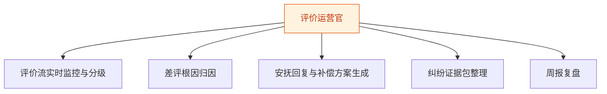
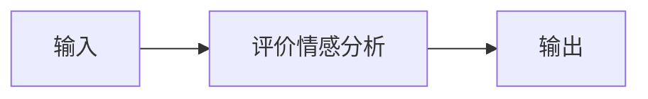
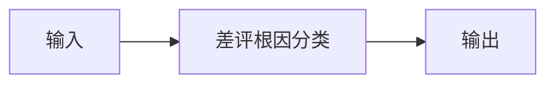
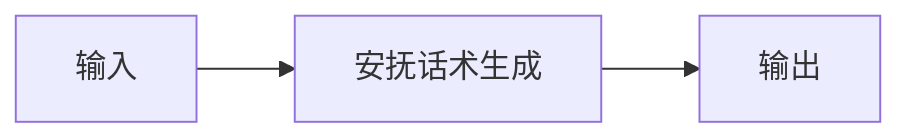
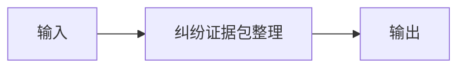
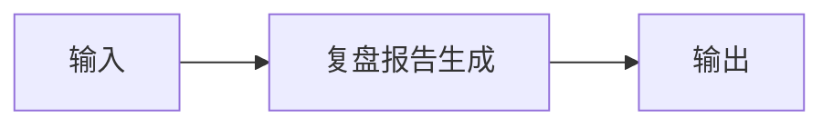

# 评价运营官 — 工作流流程图

本员工共 **5 条工作流**，下辖 **5 个原子技能**。

## 总览

## 分条详情

### 评价流实时监控与分级

| 项目 | 内容 |
|------|------|
| 触发 | 定时（每 30 分钟） |
| 复杂度 | `M` |
| 阶段 | `P0` |
| ROI | 抢回差评黄金 2 小时窗口 |

### 差评根因归因

| 项目 | 内容 |
|------|------|
| 触发 | 事件（新差评） |
| 复杂度 | `S` |
| 阶段 | `P0` |
| ROI | 归因准确率决定补救有效性 |

### 安抚回复与补偿方案生成

| 项目 | 内容 |
|------|------|
| 触发 | 人工确认 |
| 复杂度 | `S` |
| 阶段 | `P0` |
| ROI | 一条差评挽回≈保住链接日销 |

### 纠纷证据包整理

| 项目 | 内容 |
|------|------|
| 触发 | 人工 |
| 复杂度 | `M` |
| 阶段 | `P1` |
| ROI | 仅退款场景胜率提升 |

### 周报复盘

| 项目 | 内容 |
|------|------|
| 触发 | 定时（周一） |
| 复杂度 | `S` |
| 阶段 | `P0` |
| ROI | 月省复盘 8h≈¥240 |

## 汇总表

| # | 工作流 | 阶段 | 复杂度 | 触发 | 涉及技能数 |
|---|--------|------|--------|------|-----------|
| 1 | 评价流实时监控与分级 | `P0` | `M` | 定时（每 30 分钟） | 1 |
| 2 | 差评根因归因 | `P0` | `S` | 事件（新差评） | 1 |
| 3 | 安抚回复与补偿方案生成 | `P0` | `S` | 人工确认 | 1 |
| 4 | 纠纷证据包整理 | `P1` | `M` | 人工 | 1 |
| 5 | 周报复盘 | `P0` | `S` | 定时（周一） | 1 |

---

*本图由 build_p0_assets.py 自动生成*
