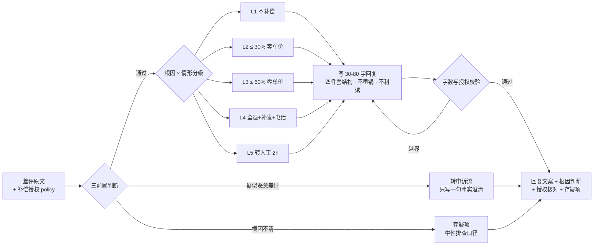

# 安抚话术生成 Appease Script Generate

> 原子技能 ｜ 属于「评价运营官」 ｜ 电商小卖家客群 ｜ T2 提示词型（纯提示词，无脚本）
>
> **为每条差评写出 30-80 字、引用原文细节、带真实解决方案的公开回复——它真正写给未来 1000 个进店买家看。**
> 回复前三个前置判断（根因/恶意/授权）· 30-80 字硬性字数校验 · 结构四件套 · L1-L5 处置分级（成本封顶 ≤ 客单价 30%/60%）· 根因措辞要点 + 追评特别处理


*上图来自实跑产物预览：模型按 prompt.txt 对「物流慢等了 5 天，整体好评」的评价生成 77 字回复，判 L2 物流级、15 元券在 20 元授权内，附完整根因判断与授权核对。*

---

## 它做什么（规则体系，逐条可查）

### 一、回复前的三个前置判断（缺一不写）

| 判断 | 规则 | 不满足时 |
|---|---|---|
| 根因是否已定 | 无标注则自行判断并给依据 | 根因不清（只写「不行」）→ 存疑项，用中性排查口径 |
| 是否疑似恶意差评 | 评价与订单对不上、拒收却评质量、同行特征 | 不写安抚回复，转 dispute-evidence-pack-flow 申诉；公开回复只写一句事实澄清 |
| 授权边界 | policy 没有的补偿绝不写进文案 | 授权范围内也按分级给，不是给到顶 |

### 二、回复文案规范（30-80 字，硬性）

结构四件套：**认领问题（引原文细节）→ 说明原因（不甩锅快递/供应商）→ 给方案（具体到动作与时间）→ 留通道（私信/客服入口）**

- ✅ 正例（58 字）：「您收到的果切确实有 2 块发软（冷链车周三故障 3 小时），当单已全款退回，周三前补发一份新批次，您私信客服报订单尾号 6688 即可。」
- ❌ 模板腔：「亲，非常抱歉给您带来不好的体验，我们会努力改进哦。」——没有细节没有方案，对潜在买家是负分
- ❌ 甩锅：「物流问题找快递公司」——公开回复推责等于告诉所有买家出事没人管
- ❌ 利诱违规：「改好评返 5 元红包」——违反《反不正当竞争法》第 8 条

字数校验：< 30 字缺方案细节，> 80 字公开页阅读疲劳，两端都要改。

### 三、处置分级（情感级别 × 根因，成本从低到高）

| 级别 | 情形 | 标准处置 | 成本口径 |
|---|---|---|---|
| L1 | 3 星 / 期望差 | 中性回复 + 邀请补充细节，不补偿 | 0 元 |
| L2 | 1-2 星物流/描述不符 | 补发配件 / 无门槛券 5-10 元 | ≤ 客单价 30% |
| L3 | 1-2 星工艺质量（非安全） | 补发整件或部分退款 30%-50% | ≤ 客单价 60% |
| L4 | 质量安全（变质/异物/过敏） | 全额退款 + 补发 + 主动电话 + 留证上报 | 不设上限 |
| L5 | 涉诉风险词（12315/曝光/媒体） | 停用模板，转人工 + 店长 2 小时内介入 | 不设上限 |

同一买家 30 天内第二次 L3 以上补偿 → 升级人工审核（防职业索赔）；补偿超客单价 60% 且非 L4 → 必须人工确认。

### 四、根因措辞要点 + 追评特别处理

- **物流**：写实际天数 +「已催办+补偿」双动作；只承诺自己可控的动作（「48 小时内出库」），不承诺到货日期
- **质量（非安全）**：换货优先于退款（保复购），写明新批次已自检
- **描述不符**：先承认口径差异，再说明详情页已修正位置——公开回复里做合规自证
- **追评差评**：必须引用追评内容（不是首评），写清首评到追评之间商家做过什么；已履约的用事实时间线说明，不指责买家

## 真实输入 → 真实输出

**输入**（`examples/input.json`）：评价 `{star: 3, text: "商品很好，物流慢了点，等了5天才到"}` + policy「可补偿无门槛优惠券，单张最高 20 元；无退款授权」。

**输出**（实跑产物，节选）：

| 项 | 内容 |
|---|---|
| 分级 | L2 物流（3 星，买家整体情绪正面） |
| 回复（77 字） | 您对口味的认可我们收到了！这单确实等了 5 天，大促后出库积压是我们没排好产能，已反馈仓库把该区域发货提到优先级，送您 15 元无门槛券，私信客服报订单尾号即可领取。 |
| 处置 | 发放 15 元无门槛券（在 20 元授权内）+ 仓库发货优先级反馈 |
| 授权核对 | 在 policy 授权内，客服执行前核对订单尾号 |

完整根因判断与补救建议见 [`examples/output.md`](examples/output.md)。

## 处理流水线



## 快速开始（纯提示词，3 步）

```text
1. 打开 prompt.txt，全文复制
2. 粘贴到 Coze / WorkBuddy / Dify / Claude / ChatGPT
3. 按 schema.json 提供：差评原文（星级/文字/是否追评）+ 补偿授权 policy
```

本资产为 T2 提示词型，无脚本依赖；分级与补偿成本口径由模型按 prompt.txt 规则执行。

## 面向谁 / 什么时候用

| ✅ 该用 | ❌ 别用 |
|---|---|
| 差评回复没头绪，要能直接发布的公开文案 | 写无细节的模板腔（「亲，抱歉」类） |
| 拿不准补偿给多少（按 L1-L5 分级与授权封顶） | policy 之外的补偿（未授权退款绝不承诺） |
| 追评差评需要展示履约时间线 | 用利诱换改评（返现/赠品换好评均违规） |

## 边界与合规

- 输出为 **AI 辅助生成内容**，每条回复发布前必须人工确认
- 不在公开回复中承认未经核实的质量问题（留证前写「正在核实」），避免被截图作为自认证据
- 不编造「已退款/已补发」——写了就必须真的已发生；L4/L5 案件全程人工处理

## 文件地图

```text
├── README.md          ← 本文件
├── SKILL.md           ← 资产定义（元信息 / 契约 / 边界）
├── prompt.txt         ← 提示词本体（前置判断 + 字数规范 + L1-L5 分级）
├── schema.json        ← 输入输出契约（机器可读）
├── examples/          ← 真实输入 + 实跑输出（77 字话术样例）
└── docs/              ← 9 项配套文档（架构 / 流程 / 场景 / 测试报告…）
```

---

*本资产遵循 [bangwozuo 数字员工资产规范](https://github.com/bangwozuo/digital-employee-spec) v3.0 ｜ [所属员工：评价运营官](../../) ｜ [总入口](https://github.com/bangwozuo/digital-employees-hub-zh)*
