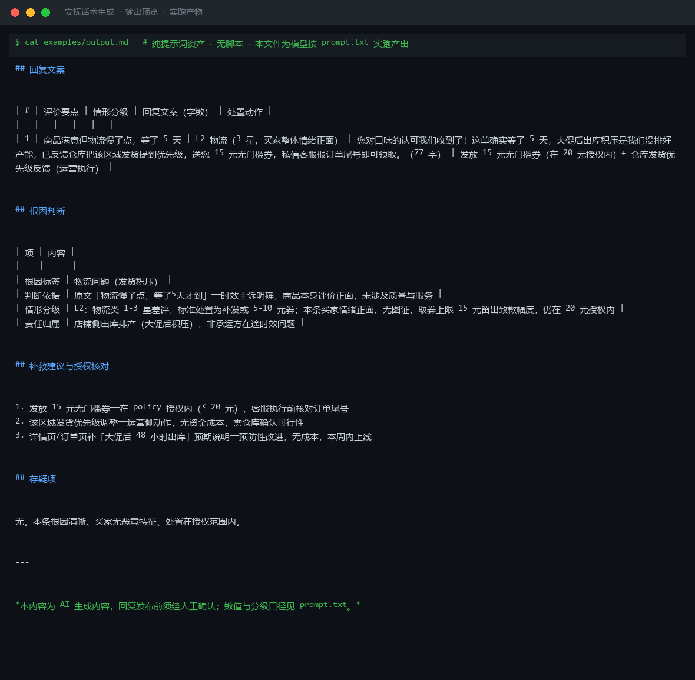

# 截图与录屏

> 以下素材均来自**真实执行**：`--run` 实拍终端 / 实跑产物文件，无摆拍。

## 演示视频


*Hyperframes 动态渲染 11s：命令逐字敲入（光标闪烁）→ 21 行真实输出逐行流式 → 完成态保持*

## 执行截图




---

## 附录：实跑输出明细

> 本资产为纯提示词客户端资产，无界面可截图。以下为**实跑运行效果**。

## 运行效果

### 输入

```json
{
  "reviews": "商品很好，物流慢了点",
  "root_cause": "物流延迟",
  "policy": "可补偿优惠券，最高 20 元"
}

```

### 输出

## 回复文案

| # | 评价要点 | 回复文案 | 处置动作 |
|---|---|---|---|
| 1 | 商品满意，物流延迟 | 亲爱的顾客，非常感谢您对商品质量的认可！关于物流速度未达预期，我们深表歉意。经核实，该订单因物流高峰期出现短暂延迟，并非我们的常态服务标准。为表歉意，我们已为您准备一张 15 元无门槛优惠券，可在下次购物时使用。期待再次为您服务！ | 发放 15 元优惠券（在 20 元授权范围内） |

## 根因判断

| 项 | 内容 |
|----|------|
| 根因标签 | 物流延迟 |
| 判断依据 | 用户明确提及"物流慢了点"，商品评价为正面，问题集中在配送时效 |
| 责任归属 | 第三方物流/配送环节 |
| 严重等级 | 轻度（用户整体情绪正面，未表达强烈不满） |

## 补救建议

1. 主动向物流合作方反馈该条配送时效问题，要求优化对应区域的发货优先级
2. 在商品详情页或订单确认环节增加物流时效说明，降低用户预期差
3. 对轻度延迟场景建立标准化安抚话术与小额补偿机制，提升响应效率

*本内容为 AI 生成内容，仅供参考，对外发布前请人工确认。*


---

*运行效果由实跑验证生成*
