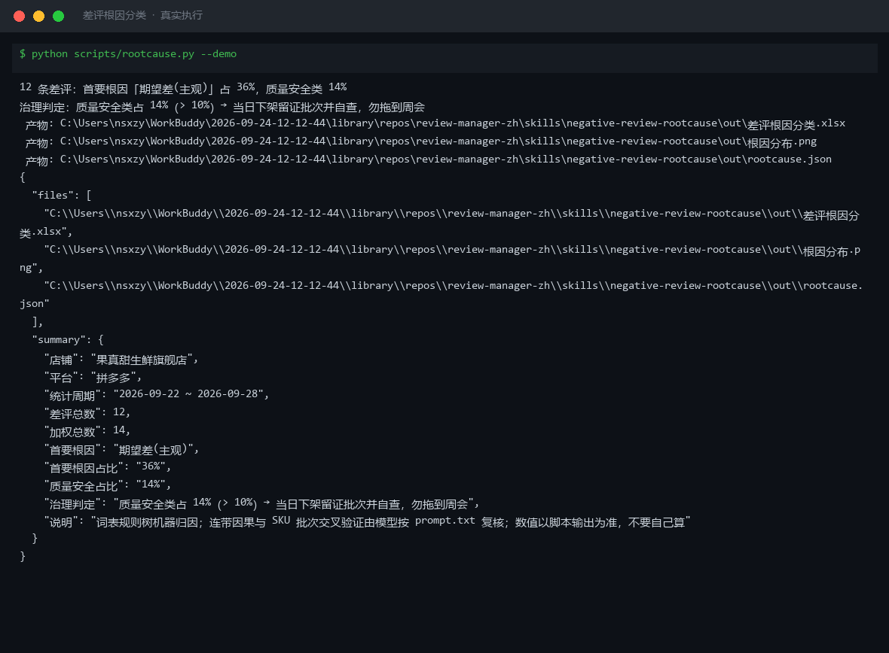
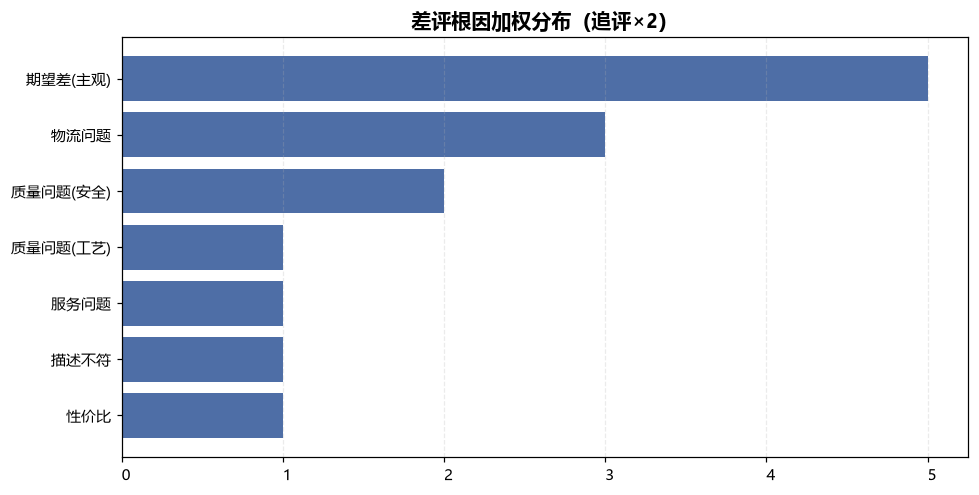
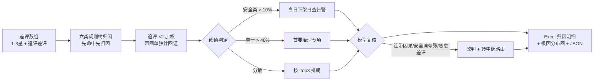

# 差评根因分类 Negative Review Rootcause

> 原子技能 ｜ 属于「评价运营官」 ｜ 电商小卖家客群 ｜ T1 产物型（脚本交付真实文件）
>
> **把每条 1-3 星差评归到六类根因之一，输出「首要治理专项 + 带数字目标的改进项」。**
> 六类根因规则树（按顺序匹配）· 追评权重 ×2 · 单一根因 > 40% 判专项、质量安全 > 10% 当日处理 · 连带因果链拆解 · 一次运行输出 Excel + 分布图




🎬 **[▶ 观看高清完整版（mp4）](https://cdn.jsdelivr.net/gh/bangwozuo/review-manager-zh@main/skills/negative-review-rootcause/docs/assets/demo.mp4)** — 四幕数据叙事：业务钩子 → 真实执行 → 指标条形图生长 → 交付物

*上图来自真实执行：内置样例 12 条差评（3 条带图、2 条追评）→ 加权总数 14，质量安全类占 14% 触发「当日下架自查」告警，产物落盘 Excel + PNG + JSON。*

---

## 它做什么（规则体系，逐条可查）

### 一、六类根因判定规则树（按顺序匹配，先命中先归因）

| 序 | 根因 | 判定关键词 | 优先级 |
|---|---|---|---|
| 1 | 质量问题（安全） | 变质、发霉、异物、异味、腹泻、过敏、中毒 | **最高：命中即当日处理，下架留证批次自查** |
| 2 | 质量问题（工艺） | 破损、碎、漏液、做工粗糙、以次充好、假货 | 常规 |
| 3 | 物流问题 | 发货慢、等 N 天、暴力分拣、压坏、漏发错发丢件 | 常规 |
| 4 | 服务问题 | 客服态度、敷衍、已读不回、退款慢、售后无门 | 常规 |
| 5 | 描述不符 | 与详情页不符、色差、分量缩水、克重不足 | 常规 |
| 6 | 性价比 | 太贵、不值、降价快（仅当价格是唯一主诉） | 常规 |
| 7 | 期望差（主观） | 都不命中才归此类——「不合口味」≠ 质量问题 | 兜底 |

**连带归因**：「物流慢导致坏果」拆成两个标签——主根因取最先触发方（物流），次标签记质量。只归主根因会把治理火力引错方向。

### 二、加权与阈值

| 规则 | 数值 | 理由 |
|---|---|---|
| 追评权重 | ×2 | 追评是收货使用后的补充评价，比首评更可信 |
| 单一根因占比 | > 40% | 判首要治理专项 |
| 质量安全类占比 | > 10% | 当日立即处理，勿等周会 |
| 样本量下限 | < 10 条 | 不做占比结论（小样本占比波动 ≥ 20 个百分点），只列明细逐条处置 |

带图差评单独统计「图证数」——图证是申诉与供应商追责的证据，要求商家存档原图。

### 三、治理动作对应表（每项带数字目标，不接受空话）

| 根因 | 改进项示例 |
|---|---|
| 质量安全 | 下架批次自查报告 + 涉事订单 2 小时内全响应 |
| 工艺破损 | 破损率降至 0.5% 以下；包装加缓冲 |
| 物流 | 发货 P90 ≤ 48 小时；漏发率 < 0.3% |
| 服务 | 差评会话质检 100% 抽查；退款响应 ≤ 2 小时 |

### 四、模型复核三类误判（脚本做不了）

1. **安全词误伤**：「香到腹泻般上头」是夸张修辞——结合星级与订单状态判断，拿不准标「疑似安全，需人工确认」
2. **刷手/恶意差评**：订单对不上、拒收却评质量、批量同文案 → 不进根因统计，转 dispute-evidence-pack-flow 申诉
3. **责任错位**：「快递员态度差」不归店铺服务根因，标注「物流承运方问题」单独催运单投诉

## 真实输入 → 真实输出

**输入**（`examples/input.json`）：差评数组（`star 1-3 / text / has_image / is_followup`）。**输出**（脚本实跑，果真甜生鲜旗舰店 12 条差评，节选）：

| 根因 | 加权条数 | 占比 | 治理动作 |
|---|---|---|---|
| 期望差(主观) | 5 | 36% | 详情页加预期说明 |
| 质量问题(安全) | 2 | 14% | 当日下架留证批次自查，涉事订单 2 小时内全响应 |
| 物流问题 | 2 | 14% | 发货 P90 ≤ 48 小时，漏发率 < 0.3% |

⚠️ 首要治理判定：**质量安全类占 14%（> 10% 阈值）→ 当日下架自查**；「芒果烂了三个变质」「吃后拉肚子有异物」两条带图差评图证需存档。逐条明细共 12 条，见 [`examples/output.md`](examples/output.md)。

| 产物 | 说明 |
|---|---|
| `out/差评根因分类.xlsx` | 分布统计（安全类标红）/ 根因明细 / 汇总 |
| `out/根因分布.png` | 根因加权分布柱状图 |



## 处理流水线



## 快速开始

**方式一：提示词（任意 AI 工具）**

```text
1. 打开 prompt.txt，全文复制
2. 粘贴到 Coze / WorkBuddy / Dify / Claude / ChatGPT
3. 按 schema.json 提供 1-3 星差评数组（含追评标记与带图标记）
```

**方式二：脚本（零 AI 依赖，确定性归因）**

```bash
# 演示模式（内置真实样例）
python scripts/rootcause.py --demo
# 指定输入
python scripts/rootcause.py --input examples/input.json --outdir out
```

## 面向谁 / 什么时候用

| ✅ 该用 | ❌ 别用 |
|---|---|
| 周会前把一周差评池变成治理排期表 | 把「不合口味」当质量问题统计（期望差与质量差要分开） |
| 差评根因突然变化时定位业务事件（换供应商/换快递） | 样本 < 10 条时给占比结论 |
| 带图差评的证据归档与供应商追责准备 | 统计疑似刷手差评进根因分布（污染治理方向） |

## 边界与合规

- 输出为 **AI 辅助生成内容**，治理动作执行前经商家确认
- 质量安全类差评按《食品安全法》/《产品质量法》流程留证，涉人身伤害建议法务介入
- 恶意差评一律走平台申诉通道，不做私下删评交易

## 文件地图

```text
├── README.md                 ← 本文件
├── SKILL.md                  ← 资产定义（元信息 / 契约 / 边界）
├── prompt.txt                ← 提示词本体（六类规则树 + 阈值 + 误判复核）
├── schema.json               ← 输入输出契约（机器可读）
├── scripts/rootcause.py      ← 确定性归因脚本（规则树 → Excel/PNG/JSON）
├── examples/                 ← 真实输入 + 脚本实跑输出
├── docs/                     ← 9 项配套文档（架构 / 流程 / 场景 / 测试报告…）
└── out/                      ← 实跑产物（xlsx / 根因分布.png / json）
```

---

*本资产遵循 [bangwozuo 数字员工资产规范](https://github.com/bangwozuo/digital-employee-spec) v3.0 ｜ [所属员工：评价运营官](../../) ｜ [总入口](https://github.com/bangwozuo/digital-employees-hub-zh)*
