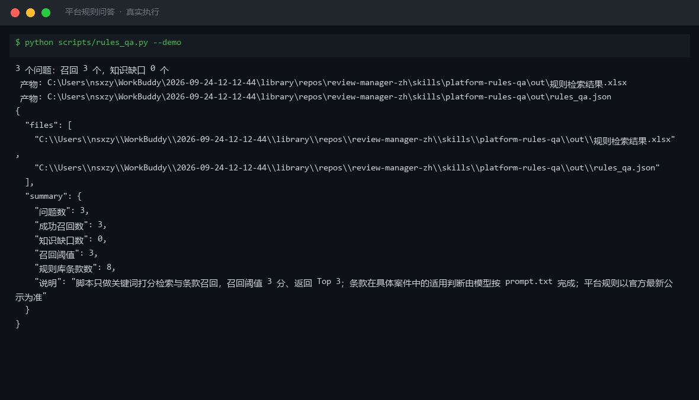
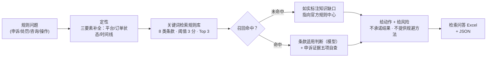

# 平台规则问答 Platform Rules QA

> 原子技能 ｜ 属于「评价运营官」 ｜ 电商小卖家客群 ｜ T1 产物型（脚本交付真实文件）
>
> **评价、申诉、售后处罚问题，每个结论都落到具体条款和下一步动作，不编条款编号。**
> 内置 8 类高频条款规则库 · 关键词召回（阈值 3 分 / 返回 Top 3）· 申诉证据五项自查 · 四步回答法（定性→条款→动作→风险）· 一次运行输出检索问答 Excel




🎬 **[▶ 观看高清完整版（mp4）](https://cdn.jsdelivr.net/gh/bangwozuo/review-manager-zh@main/skills/platform-rules-qa/docs/assets/demo.mp4)** — 四幕创作叙事：业务钩子 → 真实执行 → 要点到成稿演变 → 交付物

*上图来自真实执行：内置样例 3 个规则问题 → 3 条全部召回（得分 22 / 9 / 7，阈值 3 分），含「花钱删差评不可行」的合规判定，产物落盘 Excel + JSON。*

---

## 它做什么（规则库覆盖，逐条可查）

### 一、内置 8 类高频条款（脚本规则库）

| 规则ID | 条款 | 要点 |
|---|---|---|
| R01 | 恶意差评申诉 | 受理范围（同行攻击/敲诈勒索/涉政辱骂/无交易评价）；证据包三件套；成功率行业经验约 40-60% |
| R02 | 评价删除与修改 | 淘宝/天猫 30 天内买家可改一次，商家无删评权限；拼多多只能追评 |
| R03 | 诱导好评认定 | 好评返现/返红包/评论有礼（限好评）均违规——《反不正当竞争法》第 8 条 |
| R04 | 刷单炒信 | 《反不正当竞争法》第 8 条 + 《电子商务法》第 17 条，平台扣分降权封店 |
| R05 | 回复率与时长基准 | 回复率 100%（每条 30-80 字），差评 2 小时内响应 |
| R06 | 差评骚扰认定 | 轰炸/报复属严重违规（天猫一次扣 48 分），合规联系每天 ≤ 2 次 |
| R07 | 退款售后 | 七天无理由（签收次日起 7 天）、退款 48 小时须响应否则默认同意 |
| R08 | 评价展示权重 | 带图 > 文字 > 默认好评；追评比首评权重更高 |

### 二、恶意差评申诉证据核对（证据不全不提交）

| 证据 | 要求 | 缺失后果 |
|---|---|---|
| 订单记录 | 证明真实交易或无关联交易 | 无交易型申诉直接不成立 |
| 聊天记录 | 完整会话原始截图，含时间戳，不裁剪 | 敲诈勒索型申诉不成立 |
| 物流凭证 | 签收/拒收/未发货面单 | 「未收货差评」型申诉不成立 |
| 评价原文截图 | 含发布时间与账号信息 | 无法定位违规评价 |

申诉成功率约 40-60%，差异全在证据完整度。驳回两次以上暂停提交，人工复核案件定性。

### 三、四步回答法

1. **定性**：申诉 / 处罚 / 规则咨询 / 操作问题；拿不准先问平台、订单状态、时间线三要素
2. **给条款**：引用脚本召回的具体条款 + 出处；未召回的明确说「知识库未覆盖」，不靠常识编条款编号
3. **给动作**：落到可执行动作（「先导出完整聊天记录截图，再从恶意行为投诉入口提交」）
4. **给风险**：申诉驳回占用当日次数、私下联系超频构成骚扰、利诱改评升级处罚

## 真实输入 → 真实输出

**输入**（`examples/input.json`）：3 个规则问题（恶意差评申诉证据 / 好评返现处罚 / 花钱删差评可行性）。**输出**（脚本实跑，节选）：

| # | 问题 | 召回条款 | 得分 | 出处 |
|---|---|---|---|---|
| 1 | 买家给了恶意差评还能申诉吗？要准备什么证据？ | R01 恶意差评申诉 | 22 | 各平台商家后台恶意行为投诉规则要点 |
| 2 | 好评返现违规吗？会被怎么处罚？ | R03 诱导好评与返现 | 9 | 《反不正当竞争法》第 8 条 |
| 3 | 差评可以花钱找服务商删除吗？ | R02 评价删除与修改 | 7 | 淘宝评价规则 / 拼多多评价管理规范 |

**关键回答**：好评返现违反《反不正当竞争法》第 8 条，天猫一般违规每次扣 6 分、累计 48 分封店；淘宝/天猫评价 30 天内买家可自行修改一次，任何「付费删差评」均为违规宣称。完整回答见 [`examples/output.md`](examples/output.md)。

| 产物 | 说明 |
|---|---|
| `out/规则检索结果.xlsx` | 检索问答（未覆盖标红）/ 命中条款明细 / 申诉证据包清单 |
| `out/rules_qa.json` | 机器可读结果 |

## 处理流水线



## 快速开始

**方式一：提示词（任意 AI 工具）**

```text
1. 打开 prompt.txt，全文复制
2. 粘贴到 Coze / WorkBuddy / Dify / Claude / ChatGPT
3. 按 schema.json 提问（说明平台 + 订单状态 + 事件时间线）
```

**方式二：脚本（零 AI 依赖，确定性条款召回）**

```bash
# 演示模式（内置真实样例）
python scripts/rules_qa.py --demo
# 指定输入
python scripts/rules_qa.py --input examples/input.json --outdir out
```

## 面向谁 / 什么时候用

| ✅ 该用 | ❌ 别用 |
|---|---|
| 收到恶意差评，要判断能不能申诉、证据够不够 | 要求 100% 准确零人工（平台细则随版本调整，须对照官方最新公示） |
| 拿不准某个运营动作（返现/催评/联系买家）是否违规 | 让它承诺申诉结果或删差评（判定权在平台） |
| 申诉被驳回后复盘证据缺口 | 提供换号重开、刷单冲淡差评等规避处罚方法（一律拒绝） |

## 边界与合规

- 输出为 **AI 辅助生成内容**，不构成法律意见；平台规则以官方最新公示为准
- 不编造条款编号、扣分分值、罚款金额；不承诺申诉结果
- 用户提供的聊天记录等证据涉及隐私，提示脱敏后再提交给第三方

## 文件地图

```text
├── README.md                 ← 本文件
├── SKILL.md                  ← 资产定义（元信息 / 契约 / 边界）
├── prompt.txt                ← 提示词本体（8 类条款 + 四步回答法 + 证据核对）
├── schema.json               ← 输入输出契约（机器可读）
├── scripts/rules_qa.py       ← 确定性检索脚本（条款召回 → Excel/JSON）
├── examples/                 ← 真实输入 + 脚本实跑输出
├── docs/                     ← 9 项配套文档（架构 / 流程 / 场景 / 测试报告…）
└── out/                      ← 实跑产物（规则检索结果.xlsx / rules_qa.json）
```

---

*本资产遵循 [bangwozuo 数字员工资产规范](https://github.com/bangwozuo/digital-employee-spec) v3.0 ｜ [所属员工：评价运营官](../../) ｜ [总入口](https://github.com/bangwozuo/digital-employees-hub-zh)*
