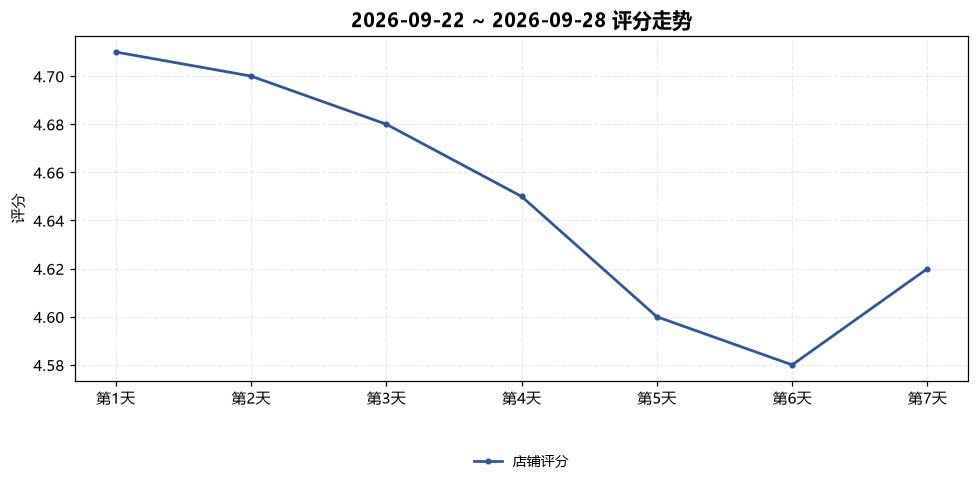
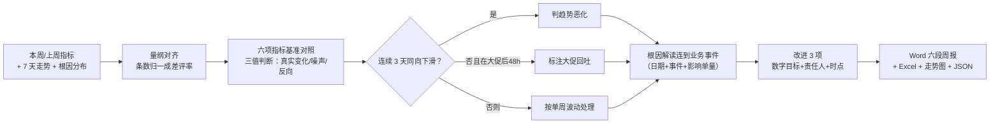

# 复盘报告生成 Review Report Generate

> 原子技能 ｜ 属于「评价运营官」 ｜ 电商小卖家客群 ｜ T1 产物型（脚本交付真实文件）
>
> **把一周评价数据写成决策者 5 分钟能读完、周会能直接过、下周能直接执行的复盘报告。**
> 固定六段结构 · 6 项指标基准对照（评分 4.7 / 好评率 95% / 差评率 3% / 回复率 100% / 差评响应 2h / 一般响应 24h）· 三值判断法（真实变化 > 2pct / 噪声 / 反向）· 一次运行输出 Word 周报 + Excel + 走势图


🎬 **[▶ 观看演示视频](docs/assets/demo.mp4)** — 四幕数据叙事：业务钩子 → 真实执行 → 指标条形图生长 → 交付物

*上图来自真实执行：内置样例（悦己家居旗舰店，本周评分 4.62 vs 上周 4.68）→ 判「低于 4.7 达标线，须专项治理，首要根因物流占 56%」，产物落盘 Word + Excel + PNG + JSON。*

---

## 它做什么（六段结构 + 归因方法）

### 一、周报六段结构（固定，缺数据段位标「数据缺失」，不编造）

| 段 | 内容 | 关键规则 |
|---|---|---|
| 1 | 核心结论 | 一句话：评分、达标与否、首要根因、要不要专项 |
| 2 | 评分走势 | 7 天走势图；大促后 48 小时差评冲高属正常回吐不算趋势；连续 3 天同向下滑才算趋势 |
| 3 | 指标对照 | 六项指标逐项标「达标/未达标」，变化给绝对值不给百分比修辞 |
| 4 | 根因分布 | 首要根因 > 40% 即专项；解释必须连到业务动作与事件，不是「物流有待提升」 |
| 5 | 回复情况 | 回复率每漏 1 条都列出是哪条、为什么漏 |
| 6 | 下周改进 3 项 | 根因 Top 3，每项带数字目标 + 责任人 + 完成时点 |

### 二、指标基准对照表

| 指标 | 基准 | 本周实测（样例） | 判定 |
|---|---|---|---|
| 店铺评分 | ≥ 4.7 | 4.62 | 未达标 |
| 好评率 | ≥ 95% | 93.6% | 未达标 |
| 差评率 | ≤ 3% | 4.6% | 未达标（专项治理） |
| 回复率 | 100% | 94% | 未达标 |
| 差评响应 | ≤ 2 小时 | 3.5 小时 | 未达标 |
| 一般评价响应 | ≤ 24 小时 | 21.0 小时 | 达标 |

### 三、对比归因方法（写得像分析师，不像表格搬运工）

1. **先对齐量纲**：单量涨 30% 时差评条数上升不算恶化，用差评率对比
2. **三值判断法**：变化 > 2 个百分点 = 真实变化；≤ 2 个百分点 = 噪声不下结论；好评差评同涨 = 统计口径问题
3. **同因溯源**：评分下滑 + 上周有换供应商/换快递/大促事件 → 显式建立因果并写明日期；没有事件就承认「原因待查」
4. **回复率是转化指标**：差评 2 小时未回复会被后续买家看到并放大，周报按转化口径写

## 真实输入 → 真实输出

**输入**（`examples/input.json`）：本周/上周指标 + 7 天评分走势 + 根因分布。**输出**（脚本实跑核心结论原文）：

> 本周评分 4.62，低于 4.7 达标线，须专项治理。首要根因「物流问题」占差评 56%，多项基准未达标，周会逐项定责任人与数字目标。

**下周改进 3 项（自动带数字目标）**：

| 根因 | 占比 | 动作与数字目标 |
|---|---|---|
| 物流问题 | 56% | 发货 P90 压到 48 小时内；漏发率 < 0.3% |
| 描述不符 | 25% | 详情页逐项修正，色差类补实拍图 |
| 质量问题(工艺) | 12% | 供应商整改单 + 破损率降至 0.5% 以下 |

完整报告见 [`examples/output.md`](examples/output.md)。

| 产物 | 说明 |
|---|---|
| `out/评价周报.docx` | 六段式 Word 周报（走势图内嵌、人工确认事项） |
| `out/评价周报数据.xlsx` | 指标对照（未达标标红）/ 根因分布 / 改进项 |
| `out/评分走势.png` | 7 天评分折线图 |



## 处理流水线



## 快速开始

**方式一：提示词（任意 AI 工具）**

```text
1. 打开 prompt.txt，全文复制
2. 粘贴到 Coze / WorkBuddy / Dify / Claude / ChatGPT
3. 按 schema.json 提供本周/上周指标、7 天走势、根因分布
```

**方式二：脚本（零 AI 依赖，确定性报告生成）**

```bash
# 演示模式（内置真实样例）
python scripts/report_gen.py --demo
# 指定输入
python scripts/report_gen.py --input examples/input.json --outdir out
```

## 面向谁 / 什么时候用

| ✅ 该用 | ❌ 别用 |
|---|---|
| 每周一出周报复盘，周会直接过 | 把条数当比率对比（量级变化必须先归一） |
| 差评率 > 3% 时立项专项治理 | 写「整体向好」这类与数据脱节的总结 |
| 数据缺口明确化（缺哪项列哪项） | 用估算值填充缺失数据 |

## 边界与合规

- 报告标注 **AI 生成内容**，数据以平台导出与脚本统计为准
- 对外（平台小二/供应商）引用前必须人工复核，供应商追责仅引用已存证图证
- 引用评价内容须脱敏，不出现评价者昵称全显/手机号

## 文件地图

```text
├── README.md                 ← 本文件
├── SKILL.md                  ← 资产定义（元信息 / 契约 / 边界）
├── prompt.txt                ← 提示词本体（六段结构 + 归因方法 + 基准表）
├── schema.json               ← 输入输出契约（机器可读）
├── scripts/report_gen.py     ← 确定性报告脚本（基准对照 → Word/Excel/PNG/JSON）
├── examples/                 ← 真实输入 + 脚本实跑输出
├── docs/                     ← 9 项配套文档（架构 / 流程 / 场景 / 测试报告…）
└── out/                      ← 实跑产物（docx / xlsx / 评分走势.png / json）
```

---

*本资产遵循 [bangwozuo 数字员工资产规范](https://github.com/bangwozuo/digital-employee-spec) v3.0 ｜ [所属员工：评价运营官](../../) ｜ [总入口](https://github.com/bangwozuo/digital-employees-hub-zh)*
