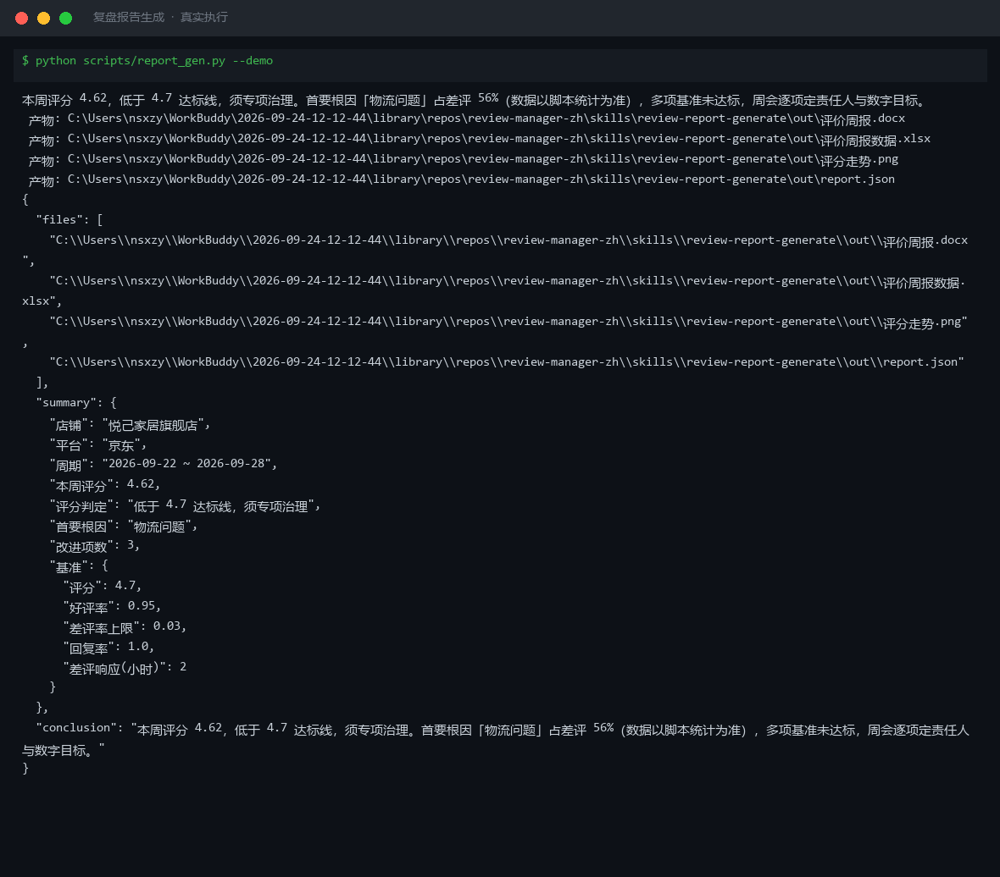

# 截图与录屏

> 以下素材均来自**真实执行**：`--run` 实拍终端 / 实跑产物文件，无摆拍。

## 演示视频


*Hyperframes 动态渲染 15s：命令逐字敲入（光标闪烁）→ 21 行真实输出逐行流式 → 实跑产物 Ken Burns 缓推*

## 执行截图



## 实跑产物

| 文件 | 说明 |
|---|---|
| [`out/report.json`](out/report.json) | 结构化结果（实跑生成） · 2 KB |
| [`out/评价周报.docx`](out/评价周报.docx) | Word 文档（实跑生成） · 78 KB |
| [`out/评价周报数据.xlsx`](out/评价周报数据.xlsx) | Excel 工作簿（实跑生成） · 8 KB |
| [`out/评分走势.png`](out/评分走势.png) | 图表产物（实跑生成） · 44 KB |


---

## 附录：实跑输出明细

> 本资产为纯提示词客户端资产，无界面可截图。以下为**实跑运行效果**。

## 运行效果

### 输入

```json
{
  "metrics": "今日销售额 5000，访客 300，转化率 1.2%",
  "period": "（周期：报告覆盖的时间范围（可选））"
}

```

### 输出

## 核心结论

今日店铺销售表现处于低位运行，转化率 1.2% 低于行业常见水平，需重点排查流量质量与详情页转化能力。

## 关键指标

| 指标 | 本期 | 上期 | 变化 | 说明 |
|---|---|---|---|---|
| 销售额 | 5000 元 | — | — | 单日数据，缺乏上期对比 |
| 访客数 | 300 | — | — | 流量规模较小 |
| 转化率 | 1.2% | — | — | 低于电商平均水平（通常 2%-3%），存在优化空间 |

## 驱动因素

1. **流量基数有限**：300 访客量偏小，可能受推广预算或自然流量波动影响
2. **转化效率不足**：1.2% 转化率提示商品详情页、价格竞争力或评价管理可能存在短板
3. **数据缺失**：未提供上期数据，无法判断趋势方向；未提供客单价，无法评估 GMV 结构

## 行动建议

1. 补充上期同期数据，建立环比/同比基准，确认当前表现是常态波动还是异常下滑
2. 针对转化率偏低问题，排查商品详情页加载速度、主图吸引力、价格带竞争力及差评影响
3. 若评价相关差评率上升，建议同步启动差评根因归因与安抚话术生成流程

*本内容为 AI 生成内容，仅供参考，对外发布前请人工确认。*


---

*运行效果由实跑验证生成*
