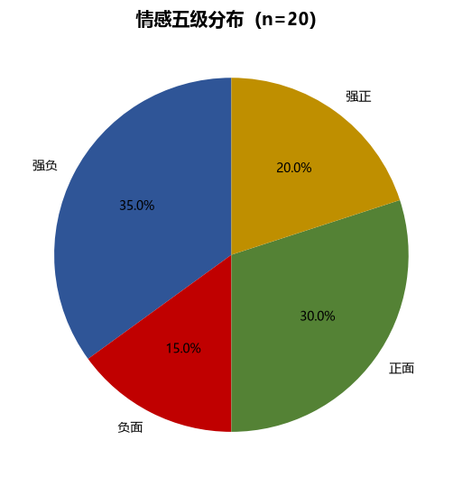
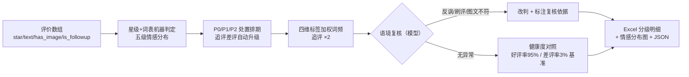

# 评价情感分析 Review Sentiment Analyze

> 原子技能 ｜ 属于「评价运营官」 ｜ 电商小卖家客群 ｜ T1 产物型（脚本交付真实文件）
>
> **把一批评价按五级情感分级、排出今日处置顺序，让团队每天早上知道「先处理哪几条、为什么」。**
> 五级情感判定 · P0/P1/P2 处置优先级（P0 带图差评 2 小时 SLA）· 四维负面标签归因 · 追评权重 ×2 · 一次运行输出 Excel 明细 + 2 张分布图


*上图来自真实执行：内置样例 20 条评价（含 4 条带图差评、4 条追评）→ 好评率 50.0% / 差评率 35.0%，P0 带图差评 4 条，产物落盘 Excel + 2 张 PNG + JSON。*

---

## 它做什么（规则体系，逐条可查）

### 一、情感五级判定（先看星级，再看内容）

| 级别 | 判定 | 典型特征 |
|---|---|---|
| 强负 | 1-2 星 | 退货退款、投诉、要求赔偿、安全类（腹泻/过敏/破损致伤） |
| 负面 | 3 星 | 明确不满但未行动，或正负并存且偏负 |
| 中 | 无文字 | 只打星不写字（默认好评单独标注口径，不计入真实好评率） |
| 正面 | 4 星 | 满意但带保留意见 |
| 强正 | 5 星且带图文（或文字 ≥ 15 字） | 复购描述、细节夸赞、晒图 |

### 二、处置优先级（决定今天先干谁）

| 优先级 | SLA | 范围 |
|---|---|---|
| **P0 带图差评** | **2 小时内** | 星 ≤ 3 且带图——展示在详情页首屏，对转化影响最大 |
| P1 强负无图 | 12 小时内 | 含涉诉风险词（12315/工商/举报/过敏/腹泻）直接转人工 + 店长介入 |
| P2 负面（3 星） | 24 小时内 | 重点挖「为什么没给 1 星也没给 4 星」的中间态原因 |
| 追评差评 | 自动升一级 | 追评比首评更可信、展示权重更高，词频归因权重 ×2 |

### 三、四维负面标签归因（追评 ×2 加权）

| 维度 | 例词 |
|---|---|
| 口味/质量 | 难吃、变质、碎、破损、假货、做工粗糙 |
| 服务 | 客服态度、敷衍、退款慢、售后无门 |
| 物流 | 发货慢、暴力分拣、漏发错发、包装破损 |
| 性价比 | 太贵、不值、分量缩水、降价快 |

单一标签占负面词频 > 40% → 列为首要治理专项；分散时按 Top 3 排期。归因必须引用原句证据。

### 四、模型复核三类误判（脚本做不了）

1. **反讽**：「真是太好了呢，三天就碎了」——正面词 + 具体负面事实并存 → 按负面处理
2. **默认好评/水军**：无文字五星、同文案批量、新号集中好评 → 剔除好评率口径并标注「疑似刷评」
3. **图文不符**：图是商品、文是价格吐槽 → 按 4 星正面但性价比标签计入负面归因

## 真实输入 → 真实输出

**输入**（`examples/input.json`）：店铺 + 平台 + 周期 + 评价数组（每条 `star / text / has_image / is_followup`）：

```json
{
  "shop": "川味鲜食品旗舰店", "platform": "天猫", "period": "2026-09-22 ~ 2026-09-28",
  "reviews": [
    {"star": 1, "text": "吃到变质发霉的，客服已读不回，再不处理就打12315投诉", "has_image": true, "is_followup": false},
    {"star": 2, "text": "包装压坏了半盒，物流太慢等了6天，客服态度还敷衍", "has_image": true, "is_followup": false}
  ]
}
```

**输出**（脚本实跑，节选）：

| 指标 | 实测 | 判定 |
|---|---|---|
| 好评率 | 50.0% | 低于基准 95%，须提升 |
| 差评率(1-2星) | 35.0% | 超过 3%，须专项治理 |
| 带图差评 | 4 条 | P0 优先处理 |
| 涉诉风险评价 | 2 条 | 含 12315/投诉/安全词，转人工即时处理 |

负面标签加权词频：口味/质量 31% ｜ 服务 31% ｜ 物流 31% ｜ 性价比 8%——分散（无单项 > 40%），按 Top3 排期。完整 20 条明细见 [`examples/output.md`](examples/output.md)。

| 产物 | 说明 |
|---|---|
| `out/评价情感分析.xlsx` | 分级明细（P0 标红）/ 标签词频 / 健康度对照 |
| `out/情感分布.png` | 五级情感占比饼图 |
| `out/负面标签Top.png` | 负面标签加权频次柱状图 |



## 处理流水线



## 快速开始

**方式一：提示词（任意 AI 工具）**

```text
1. 打开 prompt.txt，全文复制
2. 粘贴到 Coze / WorkBuddy / Dify / Claude / ChatGPT
3. 按 schema.json 提供评价数组（星级/原文/是否带图/是否追评）
```

**方式二：脚本（零 AI 依赖，确定性统计）**

```bash
# 演示模式（内置真实样例）
python scripts/sentiment_analyze.py --demo
# 指定输入
python scripts/sentiment_analyze.py --input examples/input.json --outdir out
```

## 面向谁 / 什么时候用

| ✅ 该用 | ❌ 别用 |
|---|---|
| 每天早上快速排出「今日必办」差评处置顺序 | 把默认好评当真实好评汇报好评率 |
| 批量评价的健康度体检（好评率/差评率/涉诉风险） | 要求 100% 准确零人工（反讽/刷评必须模型+人工复核） |
| 周会前的负面标签归因统计 | 抓取需登录的私域数据做分析 |

## 边界与合规

- 输出为 **AI 辅助生成内容**，对外回复发布前必须人工审核并完成 AI 内容标识
- 涉食品安全（变质/腹泻/异物）的评价，提示按《食品安全法》流程留证并下架批次自查
- 不做诱导改评（好评返现/删差评）；恶意差评走申诉通道（见 dispute-evidence-pack-flow）

## 文件地图

```text
├── README.md                      ← 本文件
├── SKILL.md                       ← 资产定义（元信息 / 契约 / 边界）
├── prompt.txt                     ← 提示词本体（五级判定 + 优先级 + 误判复核）
├── schema.json                    ← 输入输出契约（机器可读）
├── scripts/sentiment_analyze.py   ← 确定性统计脚本（五级分布 → Excel/PNG/JSON）
├── examples/                      ← 真实输入 + 脚本实跑输出
├── docs/                          ← 9 项配套文档（架构 / 流程 / 场景 / 测试报告…）
└── out/                           ← 实跑产物（xlsx / 2 张 PNG / json）
```

---

*本资产遵循 [bangwozuo 数字员工资产规范](https://github.com/bangwozuo/digital-employee-spec) v3.0 ｜ [所属员工：评价运营官](../../) ｜ [总入口](https://github.com/bangwozuo/digital-employees-hub-zh)*
