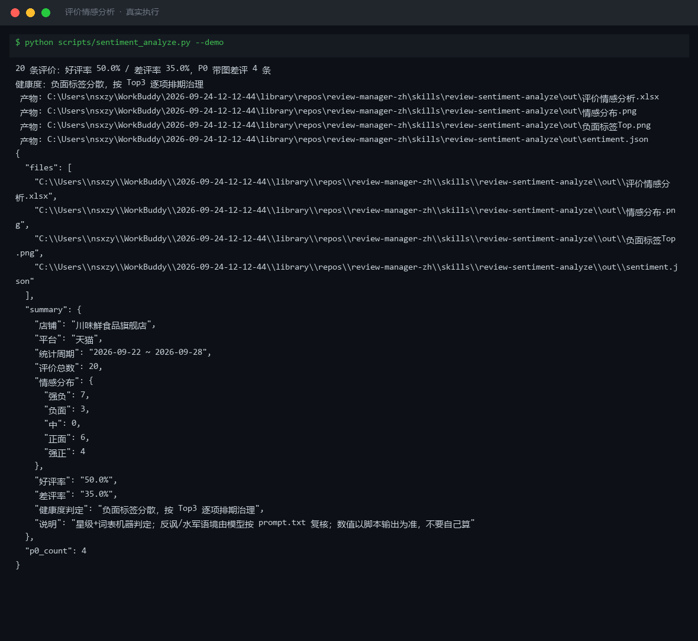

# 截图与录屏

> 以下素材均来自**真实执行**：`--run` 实拍终端 / 实跑产物文件，无摆拍。

## 演示视频


*第二帧为实跑产物图表*

## 执行截图



## 实跑产物

| 文件 | 说明 |
|---|---|
| [`out/sentiment.json`](out/sentiment.json) | 结构化结果（实跑生成） · 8 KB |
| [`out/情感分布.png`](out/情感分布.png) | 图表产物（实跑生成） · 25 KB |
| [`out/评价情感分析.xlsx`](out/评价情感分析.xlsx) | Excel 工作簿（实跑生成） · 10 KB |
| [`out/负面标签Top.png`](out/负面标签Top.png) | 图表产物（实跑生成） · 26 KB |


---

## 附录：实跑输出明细

> 本资产为纯提示词客户端资产，无界面可截图。以下为**实跑运行效果**。

## 运行效果

### 输入

```json
{
  "items": [
    "示例条目 A",
    "示例条目 B"
  ],
  "taxonomy": "（分类体系：类别定义与判定标准（可选，缺省由你提出））"
}

```

### 输出

## 分类结果

| # | 条目 | 类别 | 判定依据 |
|---|---|---|---|
| 1 | 示例条目 A | 待补充信息 | 输入仅为占位符"示例条目 A"，无实质评价内容，无法判定情感极性与紧急度 |
| 2 | 示例条目 B | 待补充信息 | 输入仅为占位符"示例条目 B"，无实质评价内容，无法判定情感极性与紧急度 |

## 分布统计

| 类别 | 数量 | 占比 |
|---|---|---|
| 待补充信息 | 2 | 100% |

## 存疑项

1. 输入的 items 为占位符文本，缺乏真实评价内容，无法执行情感极性与紧急度分级
2. 输入的 taxonomy 为占位符，未提供分类体系定义；本次未擅自发明标签，待用户提供后再行分类

---

**建议使用的情感分析分类体系（供用户参考）**

| 类别 | 定义 | 判定标准 |
|---|---|---|
| 正面 | 用户表达满意、推荐或感谢 | 出现"满意""好评""推荐"等关键词，星级 ≥ 4 |
| 中性 | 用户表达客观描述或无明显情绪 | 无强烈情绪词，或正负意见并存且平衡 |
| 负面-低紧急 | 用户表达不满但未要求立即处理 | 出现"一般""有点失望"等轻度负面词 |
| 负面-高紧急 | 用户表达强烈不满并要求立即解决 | 出现"投诉""退货""骗子"等关键词，或星级 ≤ 2 |

*本内容为 AI 生成内容，仅供参考。*


---

*运行效果由实跑验证生成*
