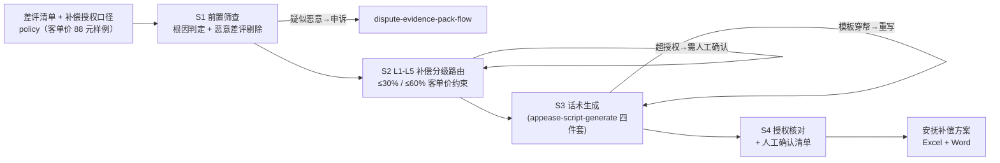

# 安抚回复与补偿方案生成 Appease Compensation Flow

> 复合技能（工作流） ｜ 属于「评价运营官」 ｜ 电商小卖家客群 ｜ T3 工作流型（4 步 DAG，脚本交付真实文件）
>
> **把一批差评变成一册可执行的安抚补偿方案：每条什么分级（L1-L5）、补多少、话术怎么写、哪些超授权必须人工确认。**
> 4 步流水线（筛查→分级路由→话术→授权核对）· L1-L5 五级补偿分级 · 客单价 30%/60% 成本约束 · 防两类事故：乱补偿、话术穿帮


🎬 **[▶ 观看演示视频](docs/assets/demo.mp4)** — 四幕创作叙事：业务钩子 → 真实执行 → 要点到成稿演变 → 交付物

*上图来自真实执行：内置样例（雾岭茶业 6 条差评，授权「券 ≤15 元、部分退款 ≤50%、无全额退款授权」，客单价 88 元）→ 分级 L1×2 / L2×1 / L3×2 / L4×1，人工确认 1 件（L4 超授权），产物落盘 Excel + Word + JSON。*

---

## 流程 DAG（真实步骤）



## 分步做什么（每步含失败处理）

| 步 | 处理 | 失败处理 |
|---|---|---|
| S1 前置筛查 | 按原文判根因；命中索要返现删评话术、同行特征 → 剔除转申诉 | 根因不清 → 存疑项走中性话术；order_id 缺失 → 补关联再定价（防职业索赔冒领） |
| S2 分级路由 | L1 0 元 → L2 补发/券 5-10 元（≤30%）→ L3 退 30%-50%（≤60%）→ L4 全退+补发+电话 → L5 涉诉词转人工 2h | 方案超授权 → 标「需人工确认」绝不直接执行；L4 未授权全额退款 → 升级店长定向授权 |
| S3 话术生成 | 四件套结构，每条 30-80 字；L4 公开回复写「正在核实+已升级」 | 写了「已补发」实际没发 → 退回重写为「将于 48 小时内补发」；字数越界 → 修剪 |
| S4 授权核对 | 逐条核对 policy；超授权与 L4/L5 全进人工确认清单；产出 Excel + Word | 买家拒绝补偿只要道歉 → 只发文字回复；补偿后差评未改 → 不追不催，记录案件 |

## 真实输入 → 真实输出

**输入**（`examples/input.json`）：6 条差评 + policy（补发整件；券 ≤15 元；部分退款 ≤50%；无全额退款授权）+ 客单价 88 元。**输出**（脚本实跑，节选）：

| 序号 | 分级 | 根因 | 补偿方案 | 成本上限 | 状态 |
|---|---|---|---|---|---|
| 3 | L4 | 质量问题(安全)（茶叶有异物，带图） | 全额退款 + 补发 + 主动电话 + 留证上报 ⚠️ | 不设上限 | **需人工确认（超授权）** |
| 4 | L3 | 物流问题（罐子瘪了，带图） | 补发整件或部分退款 30%-50% | ≤ ¥53（60% 客单价） | 直接执行 |
| 2 | L2 | 物流问题（物流慢 6 天受潮） | 补发配件或无门槛券 5-10 元 | ≤ ¥26（30% 客单价） | 直接执行 |
| 1 | L1 | 期望差(主观)（口感偏淡） | 无补偿，中性回复 | 0 元 | 直接执行 |

L4 话术样例（超授权走店长专线口径）：

> 「您收到的『茶叶里有异物，喝着不放心』属严重品质问题，该批次已下架送检；本单处理方案超出常规授权，已升级店长 2 小时内专线联系您。」

完整方案与人工确认清单见 [`examples/output.md`](examples/output.md)。

| 产物 | 说明 |
|---|---|
| `out/安抚补偿方案.xlsx` | 分级方案（L5 标红）/ 授权核对 / 汇总 |
| `out/安抚补偿方案.docx` | 交接用 Word（含人工确认清单与执行提醒） |
| `out/appease_flow.json` | 机器可读结果 |

## 快速开始

**方式一：提示词（任意 AI 工具，纯对话）**

```text
1. 打开 prompt.txt，全文复制
2. 粘贴到 Coze / WorkBuddy / Dify / Claude / ChatGPT
3. 按 schema.json 提供：差评清单 + 补偿授权 policy + 客单价
```

**方式二：脚本（推荐，确定性分级路由）**

```bash
# 演示模式（内置真实样例）
python scripts/run_flow.py --demo
# 指定输入
python scripts/run_flow.py --input examples/input.json --outdir out
```

## 面向谁 / 什么时候用

| ✅ 该用 | ❌ 别用 |
|---|---|
| 一批差评要出补偿方案，怕客服乱赔（怕一个月赔掉利润） | 执行 policy 之外的补偿（L4 全额退款未授权先升级再出方案） |
| 话术要与订单事实对得上（防「写了已退款钱没退」穿帮） | 用利诱换改评（返现/赠品换好评/求删差评均违规） |
| 超授权方案集中人工确认，一次审批 | 对职业索赔（30 天内二次 L3+）走标准补偿梯度——一律人工 |

## 边界与合规

- 输出为 **AI 辅助生成内容**；每条回复与补偿执行前人工确认
- L4 案件按《食品安全法》/《产品质量法》留证；对外话术不留联系方式不引导站外交易
- 补偿台账留存（金额/订单/执行人），月度对账

## 文件地图

```text
├── README.md               ← 本文件
├── SKILL.md                ← 工作流定义（DAG / 契约 / 边界）
├── prompt.txt              ← 编排提示词本体（4 步分步指令 + 失败处理）
├── schema.json             ← 输入输出契约（机器可读）
├── scripts/run_flow.py     ← 分级路由脚本（S1-S4 → Excel/Word/JSON）
├── examples/               ← 真实输入 + 脚本实跑输出
├── docs/                   ← 9 项配套文档（架构 / 流程 / 场景 / 测试报告…）
└── out/                    ← 实跑产物（xlsx / docx / json）
```

---

*本资产遵循 [bangwozuo 数字员工资产规范](https://github.com/bangwozuo/digital-employee-spec) v3.0 ｜ [所属员工：评价运营官](../../) ｜ [总入口](https://github.com/bangwozuo/digital-employees-hub-zh)*
