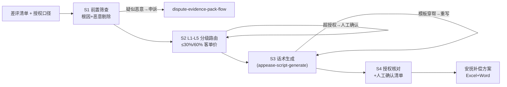

# 安抚回复与补偿方案生成

把一批差评变成可执行的安抚补偿方案：分级（L1-L5）、补偿额度、30-80 字话术、超授权人工确认清单。

**分级路由与话术模板由 `scripts/run_flow.py` 计算，数值以脚本输出为准，不要自己算。**

## 能力描述

前置筛查（根因判定 + 疑似恶意差评剔除转申诉）→ L1-L5 补偿分级路由（L1 3星期望差 0 元；L2 物流/描述不符补发或券 5-10 元 ≤ 客单价 30%；L3 工艺质量补发或退 30%-50% ≤ 60%；L4 质量安全全退+补发+电话+留证；L5 涉诉词停用模板转人工 2 小时；同一买家 30 天内二次 L3+ 升级人工防职业索赔）→ 话术生成（四件套：认领引原文/原因不甩锅/方案带时限/留通道，30-80 字；L4 公开回复只写「正在核实+已升级」）→ 授权核对（超授权标「需人工确认」绝不直接执行）。防两类事故：为息事宁人乱补偿吃掉利润；话术与事实穿帮被截图二次发酵。

## 元信息

| 字段 | 值 |
|------|-----|
| ID | `de_ecom_03_wf03` |
| 类型 | **`composite`（复合技能 / T3 工作流）** |
| 所属员工 | 评价运营官 |
| 阶段 | `P0` |
| 复杂度 | `M` |
| 触发方式 | 事件触发（差评清单到手即跑） |
| 资产形态 | 编排提示词 + Python 编排脚本（无模型调用、无 API Key） |

## 编排的原子技能

| # | 原子技能 | 在本流程中的角色 |
|---|---------|------|
| 1 | [安抚话术生成](../../skills/appease-script-generate/) | S3 话术规范同源（30-80 字四件套 / L1-L5 分级） |
| 2 | [平台规则问答](../../skills/platform-rules-qa/) | S1 恶意差评剔除后的申诉规则出口 |

## 步骤链路（DAG）



## 步骤明细

| # | 步骤 | 执行者 | 输入 | 输出 | 失败处理 |
|---|------|---------|------|------|---------|
| 1 | 前置筛查 | 脚本 | 差评清单 + policy | 有效案件集 | 根因不清走中性话术；恶意差评转申诉 |
| 2 | 分级路由 | 脚本 | 案件集 | L1-L5 + 补偿额度 | 超授权标「需人工确认」；L4 未授权升级店长 |
| 3 | 话术生成 | 脚本+模型 | 分级结果 | 30-80 字回复 | 与事实穿帮退回重写；字数越界修剪 |
| 4 | 授权核对 | 脚本 | 方案表 | 人工确认清单 | 买家拒补偿只发道歉；二次索赔走人工 |

## 输入规格

| 字段 | 类型 | 必填 | 说明 |
|------|------|------|------|
| `shop` / `platform` | string | ✅ | 店铺 / 平台 |
| `policy` | string | ✅ | 补偿授权口径，如「补发整件；券 ≤15 元；部分退款 ≤50%」 |
| `unit_price` | number | ⬜ | 客单价（计算 30%/60% 成本上限） |
| `negatives` | array | ✅ | [{star, text, has_image, is_followup, order_id?}] |

## 输出规格

| 字段 | 类型 | 说明 |
|------|------|------|
| `summary` | object | 分级分布 / 授权口径 / 人工确认件数 |
| `plans` | array | 分级方案（补偿/成本上限/话术/状态） |
| `confirm` | array | 人工确认清单（超授权 / L4 / L5） |
| 产物 | 文件 | `out/安抚补偿方案.xlsx`、`out/安抚补偿方案.docx`、`out/appease_flow.json` |

## 验收标准

- [ ] 每一步的技能资产齐全（SKILL.md / prompt.txt / schema.json）
- [ ] 超授权方案 100% 进人工确认清单，不直接执行
- [ ] 话术 30-80 字且不写未经核实的「已退款/已补发」
- [ ] 末步输出带 AI 生成标识，执行前人工确认

## 使用步骤

### 方式一：带脚本（推荐，端到端）

```bash
python3 <WF_DIR>/scripts/run_flow.py --input input.json --outdir out
python3 <WF_DIR>/scripts/run_flow.py --demo
```

### 方式二：纯对话编排

把 `prompt.txt` 全文粘贴为系统提示词 → 提供差评清单与授权口径 → 按 DAG 逐步执行，末步产出方案册。

### 平台编排

| 平台 | 编排方式 |
|------|---------|
| **Coze / 扣子** | 新建工作流 → 按步骤添加节点 |
| **Dify** | Workflow → LLM 节点链 + 代码节点（分级与核对） |
| **WorkBuddy** | 新建 Skill 按步骤串联各技能提示词 |

## 边界（不做的事）

- ❌ 不执行 policy 之外的补偿；L4 全额退款未授权先升级再出方案
- ❌ 不写未经核实的履约事实；不用利诱换改评（反法第 8 条）
- ❌ 职业索赔（30 天内二次 L3+）不走标准梯度，一律人工
- ❌ 不与买家公开缠辩；追评差评引用追评内容

## 调用示例

**输入**（`examples/input.json`）：雾岭茶业旗舰店（天猫），6 条差评，授权「补发整件；券 ≤15 元；部分退款 ≤50%；无全额退款授权」，客单价 88 元。

**输出**（脚本实跑，退出码 0）：分级 L1×2 / L2×1 / L3×2 / L4×1；**人工确认 1 件（L4 异物案：全额退款超授权，升级店长定向授权）**。L2 受潮案补偿 ≤ ¥26（30% 客单价），L3 罐瘪/色差案 ≤ ¥53。话术全部 30-80 字。产物三件：方案 Excel、交接 Word、JSON。

## 所属工作流

本资产为复合技能（工作流），是独立的端到端流程，不隶属于其他工作流。

## 合规声明

- 本技能输出为 **AI 辅助生成内容**，每条回复与补偿执行前必须人工确认
- L4 案件按《食品安全法》/《产品质量法》留证；补偿台账留存月度对账
- 对外话术不留联系方式、不引导站外交易、不含诱导改评措辞

---

*本复合技能遵循 [bangwozuo 数字员工资产规范](https://github.com/bangwozuo/digital-employee-spec) v3.0*
