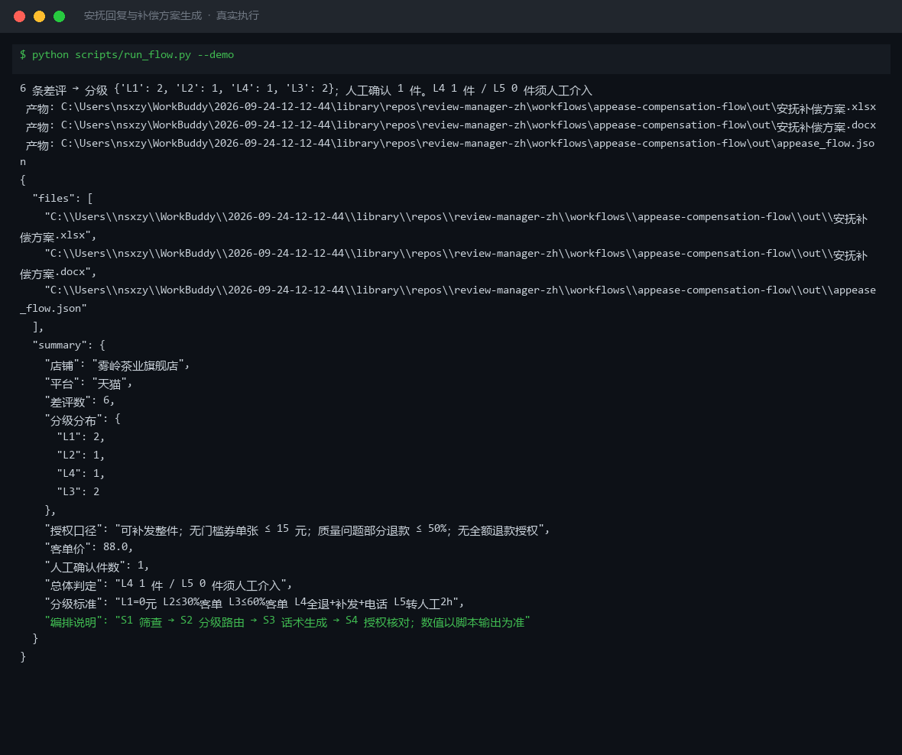

# 截图与录屏

> 以下素材均来自**真实执行**：`--run` 实拍终端 / 实跑产物文件，无摆拍。

## 演示视频


*四幕创作叙事（Hyperframes 动态渲染 19s）：业务钩子 → 真实执行 → 输入要点到成稿演变 → 交付物*

## 执行截图



## 实跑产物

| 文件 | 说明 |
|---|---|
| [`out/appease_flow.json`](out/appease_flow.json) | 结构化结果（实跑生成） · 4 KB |
| [`out/安抚补偿方案.docx`](out/安抚补偿方案.docx) | Word 文档（实跑生成） · 37 KB |
| [`out/安抚补偿方案.xlsx`](out/安抚补偿方案.xlsx) | Excel 工作簿（实跑生成） · 9 KB |


---

## 附录：实跑输出明细

> 本资产为纯提示词客户端资产，无界面可截图。以下为**实跑运行效果**。

## 运行效果

### 输入

```json
{
  "input": "请提供工作流的初始输入数据"
}

```

### 输出

## 执行摘要

工作流因缺少初始输入数据而暂停，未生成最终交付物。请补充差评文本、根因标签及处置口径后重新执行。

## 分步结果

1. **步骤 1：安抚话术生成** — 未执行。原因：输入为占位符"请提供工作流的初始输入数据"，缺少必需的 `reviews`、`root_cause`、`policy` 字段，不满足原子技能输入规格。

## 最终交付物

（无 — 待补充输入后重新运行工作流）

---

**所需输入字段**

| 字段 | 说明 | 是否必填 |
|---|---|---|
| reviews | 评价原文（含星级/关键词） | 是 |
| root_cause | 已判定的根因标签 | 否 |
| policy | 可用的补偿方式与边界 | 否 |

*本内容为 AI 生成内容，仅供参考。*


---

*运行效果由实跑验证生成*
