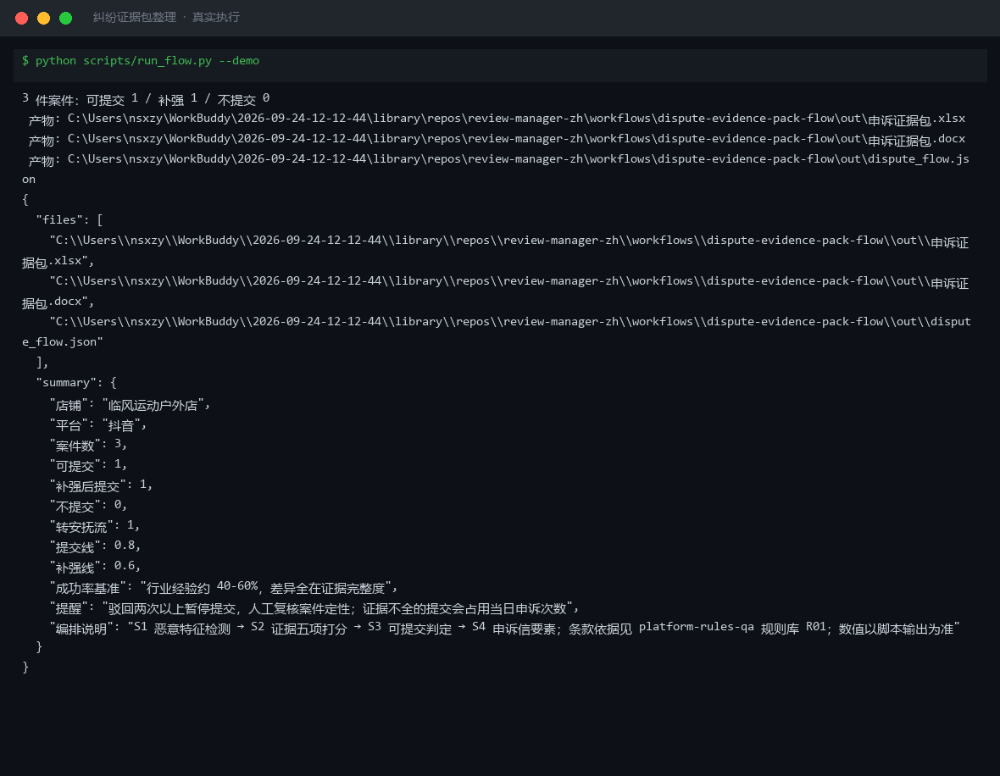
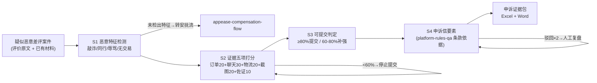

# 纠纷证据包整理 Dispute Evidence Pack Flow

> 复合技能（工作流） ｜ 属于「评价运营官」 ｜ 电商小卖家客群 ｜ T3 工作流型（4 步 DAG，脚本交付真实文件）
>
> **把疑似恶意差评案件变成一份「能过审」的申诉证据包：恶意特征是什么、证据够不够分、现在能不能提交、申诉信写什么。**
> 4 步流水线（特征检测→证据打分→可提交判定→申诉信）· 证据五项打分制（满分 100）· 提交阈值 ≥80%、补强 60-80%、<60% 禁止提交 · 防两类事故：证据不全硬提交、把真实差评当恶意识别



🎬 **[▶ 观看演示视频](docs/assets/demo.mp4)** — 四幕检测叙事：业务钩子 → 真实执行 → 检查项逐条亮灯 → 交付物

*上图来自真实执行：内置样例（临风运动户外店 3 件案件）→ 1 件敲诈勒索型（60 分）判「补强后提交」，2 件未检出恶意特征转安抚流，产物落盘 Excel + Word + JSON。*

---

## 流程 DAG（真实步骤）



## 证据五项打分制（脚本执行）

| 证据项 | 分值 | 缺失/降级规则 |
|---|---|---|
| 订单记录 | 20 | 缺失 → 无交易型申诉不成立 |
| 完整聊天记录（含时间戳） | **30** | 被裁剪（掐头去尾）→ 按 **0 分**计，重取原始截图 |
| 物流凭证 | 20 | 与订单号对不上 → 标「证据矛盾」，先内部核对 |
| 评价原文截图（含账号时间） | 20 | 缺发布时间 → 无法定位违规评价 |
| 买家行为佐证 | 10 | 辅助项 |

**判定阈值**：完整度 ≥ 80% → 可提交；60%-80% → 补强后提交（列缺项清单）；< 60% → **不提交**（驳回占用当日申诉次数，且成功率行业经验仅 40-60%，低证据提交必败）。

## 四类恶意特征（S1 检测）

| 特征 | 判定线索 |
|---|---|
| 敲诈勒索型 | 聊天里要钱/要赠品换删评 |
| 同行攻击型 | 提及低价同款、订单无关联 |
| 辱骂型 | 涉政辱骂、人身攻击 |
| 无交易型 | 评价与订单比对不上 |

**未检出特征 → 整案转安抚流**：差评描述与订单对得上的就是真实差评，硬申诉等于自曝。

## 真实输入 → 真实输出

**输入**（`examples/input.json`）：3 件案件（每件 `case_id / review_text / has_order / chat_screenshot / logistics_proof / review_screenshot / behavior_proof`）：

```json
{
  "case_id": "AP-20260929-01",
  "review_text": "垃圾店，东西根本没用过就给差评，加V给你转50删了",
  "has_order": false, "chat_screenshot": true, "logistics_proof": false,
  "review_screenshot": true, "behavior_proof": true
}
```

**输出**（脚本实跑，节选）：

| 案件ID | 恶意特征 | 证据得分 | 完整度 | 判定 |
|---|---|---|---|---|
| AP-20260929-01 | 索要返现删评、辱骂（敲诈勒索型） | 60/100 | 60% | 🟡 补强后提交（缺订单记录、物流凭证） |
| AP-20260929-02 | 未检出 | 60/100 | 60% | → 转安抚流（真实差评） |
| AP-20260929-03 | 未检出 | 90/100 | 90% | → 转安抚流（真实差评） |

AP-01 聊天记录「加V给你转50删了」命中敲诈勒索型，但缺订单记录与物流凭证——先补证再提交。完整判定与申诉信要素见 [`examples/output.md`](examples/output.md)。

| 产物 | 说明 |
|---|---|
| `out/申诉证据包.xlsx` | 案件判定（不提交标红）/ 申诉信要素 / 证据核对表 |
| `out/申诉证据包.docx` | 交接用 Word（含补证清单与执行提醒） |
| `out/dispute_flow.json` | 机器可读结果 |

## 快速开始

**方式一：提示词（任意 AI 工具，纯对话）**

```text
1. 打开 prompt.txt，全文复制
2. 粘贴到 Coze / WorkBuddy / Dify / Claude / ChatGPT
3. 按 schema.json 提供：案件列表 + 每件的已有证据材料
```

**方式二：脚本（推荐，确定性打分）**

```bash
# 演示模式（内置真实样例）
python scripts/run_flow.py --demo
# 指定输入
python scripts/run_flow.py --input examples/input.json --outdir out
```

## 面向谁 / 什么时候用

| ✅ 该用 | ❌ 别用 |
|---|---|
| 疑似恶意差评要申诉，先判定证据够不够 | 证据完整度 < 60% 硬提交（驳回占次数并拉低申诉信用） |
| 分不清该申诉还是该安抚整改 | 把真实差报送申诉（未检出恶意特征一律转安抚流） |
| 申诉信写不出四要素框架 | 伪造证据（P 图聊天记录、补打面单——虚假申诉留信用污点） |

## 边界与合规

- 输出为 **AI 辅助生成内容**；申诉材料提交前经商家人工核对订单号
- 诉求不越权（只求评价处置，不要求处罚买家账号）；不私下联系「差评人」谈判删评
- 聊天记录含买家隐私，提交给第三方前脱敏；申诉结果以平台审核为准，不承诺通过率

## 文件地图

```text
├── README.md               ← 本文件
├── SKILL.md                ← 工作流定义（DAG / 契约 / 边界）
├── prompt.txt              ← 编排提示词本体（4 步分步指令 + 失败处理）
├── schema.json             ← 输入输出契约（机器可读）
├── scripts/run_flow.py     ← 特征检测与证据打分脚本（→ Excel/Word/JSON）
├── examples/               ← 真实输入 + 脚本实跑输出
├── docs/                   ← 9 项配套文档（架构 / 流程 / 场景 / 测试报告…）
└── out/                    ← 实跑产物（xlsx / docx / json）
```

---

*本资产遵循 [bangwozuo 数字员工资产规范](https://github.com/bangwozuo/digital-employee-spec) v3.0 ｜ [所属员工：评价运营官](../../) ｜ [总入口](https://github.com/bangwozuo/digital-employees-hub-zh)*
