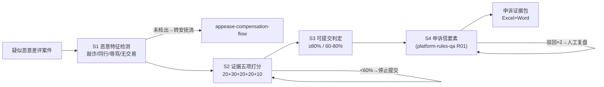

# 纠纷证据包整理

把疑似恶意差评案件变成「能过审」的申诉证据包：特征定性、五项证据打分、可提交判定、申诉信要素。

**特征检测与证据打分由 `scripts/run_flow.py` 计算，数值以脚本输出为准，不要自己算。**

## 能力描述

恶意特征检测（敲诈勒索/同行攻击/辱骂/无交易四型；**未检出特征整案转安抚流，不硬申诉**）→ 证据五项打分（订单记录 20 分 + 完整聊天记录 30 分 + 物流凭证 20 分 + 评价原文截图 20 分 + 买家行为佐证 10 分；裁剪截图按 0 分重取）→ 可提交判定（≥ 80% 可提交 / 60-80% 补强后提交 / < 60% 严禁提交——驳回占用当日申诉次数且成功率仅 40-60%）→ 申诉信四要素（事实陈述/证据清单/诉求/承诺，诉求不越权）。防两类事故：证据不全硬提交拉低申诉信用；把真实差评当恶意识别变成自曝。

## 元信息

| 字段 | 值 |
|------|-----|
| ID | `de_ecom_03_wf04` |
| 类型 | **`composite`（复合技能 / T3 工作流）** |
| 所属员工 | 评价运营官 |
| 阶段 | `P0` |
| 复杂度 | `M` |
| 触发方式 | 事件触发（疑似恶意差评案件到手即跑） |
| 资产形态 | 编排提示词 + Python 编排脚本（无模型调用、无 API Key） |

## 编排的原子技能

| # | 原子技能 | 在本流程中的角色 |
|---|---------|------|
| 1 | [平台规则问答](../../skills/platform-rules-qa/) | S4 申诉条款依据（规则库 R01：受理范围与证据要求） |
| 2 | [安抚话术生成](../../skills/appease-script-generate/) | S1 未检出恶意特征案件的安抚流出口（appease-compensation-flow 承接） |

## 步骤链路（DAG）



## 步骤明细

| # | 步骤 | 执行者 | 输入 | 输出 | 失败处理 |
|---|------|---------|------|------|---------|
| 1 | 特征检测 | 脚本 | 案件 + 评价原文 | 申诉类型 | 未检出转安抚流；特征与证据矛盾人工复核 |
| 2 | 证据打分 | 脚本 | 已有材料清单 | 完整度得分 | 裁剪截图按 0 分重取；证据矛盾先核对 |
| 3 | 可提交判定 | 脚本 | 完整度 | 提交/补强/不提交 | 驳回 ×2 暂停复盘；当日次数用尽排队 |
| 4 | 申诉信要素 | 脚本+模型 | 判定 + 证据 | 申诉信正文 | 诉求不越权；3 日未反馈走催办通道 |

## 输入规格

| 字段 | 类型 | 必填 | 说明 |
|------|------|------|------|
| `shop` / `platform` | string | ✅ | 店铺 / 平台 |
| `cases` | array | ✅ | [{case_id, review_text, has_order, chat_screenshot, logistics_proof, review_screenshot, behavior_proof}] |

## 输出规格

| 字段 | 类型 | 说明 |
|------|------|------|
| `summary` | object | 案件数 / 可提交 / 补强 / 不提交 / 成功率基准 |
| `cases` | array | 逐案判定（特征/得分/完整度/缺项） |
| `letters` | array | 申诉信四要素框架 |
| 产物 | 文件 | `out/申诉证据包.xlsx`、`out/申诉证据包.docx`、`out/dispute_flow.json` |

## 验收标准

- [ ] 每一步的技能资产齐全（SKILL.md / prompt.txt / schema.json）
- [ ] 完整度 < 60% 的案件 100% 拦截不提交
- [ ] 未检出恶意特征的案件全部转安抚流，不误报申诉
- [ ] 末步输出带 AI 生成标识，提交前人工核对订单号

## 使用步骤

### 方式一：带脚本（推荐，端到端）

```bash
python3 <WF_DIR>/scripts/run_flow.py --input input.json --outdir out
python3 <WF_DIR>/scripts/run_flow.py --demo
```

### 方式二：纯对话编排

把 `prompt.txt` 全文粘贴为系统提示词 → 提供案件与已有材料 → 按 DAG 逐步执行，末步产出证据包。

### 平台编排

| 平台 | 编排方式 |
|------|---------|
| **Coze / 扣子** | 新建工作流 → 按步骤添加节点 |
| **Dify** | Workflow → LLM 节点链 + 代码节点（打分与判定） |
| **WorkBuddy** | 新建 Skill 按步骤串联各技能提示词 |

## 边界（不做的事）

- ❌ 证据完整度 < 60% 严禁提交；不伪造证据（P 图、补打面单）
- ❌ 未检出恶意特征不送申诉——真实差评走安抚整改
- ❌ 诉求不越权（不要求处罚买家账号）；不私下联系对方谈判删评
- ❌ 申诉结果以平台审核为准，不承诺通过率

## 调用示例

**输入**（`examples/input.json`）：临风运动户外店（抖音）3 件案件：敲诈型（「加V转50删评」缺订单记录）、质量差评（描述与订单可对上）、正常差评（尺码问题客服已妥善处理）。

**输出**（脚本实跑，退出码 0）：**可提交 0 / 补强后提交 1 / 不提交 0 / 转安抚流 2**。敲诈型缺订单记录（20 分）完整度 60% → 列补证清单后提交；两件未检出恶意特征的真实差评整案转安抚流，不硬申诉。产物三件：证据包 Excel（不提交标红）、交接 Word、JSON。

## 所属工作流

本资产为复合技能（工作流），是独立的端到端流程，不隶属于其他工作流。

## 合规声明

- 本技能输出为 **AI 辅助生成内容**，申诉材料提交前必须经商家人工核对
- 聊天记录含买家隐私，提交第三方前脱敏；虚假申诉承担平台处罚后果
- 申诉结果以平台审核为准；驳回两次以上暂停提交人工复盘

---

*本复合技能遵循 [bangwozuo 数字员工资产规范](https://github.com/bangwozuo/digital-employee-spec) v3.0*
