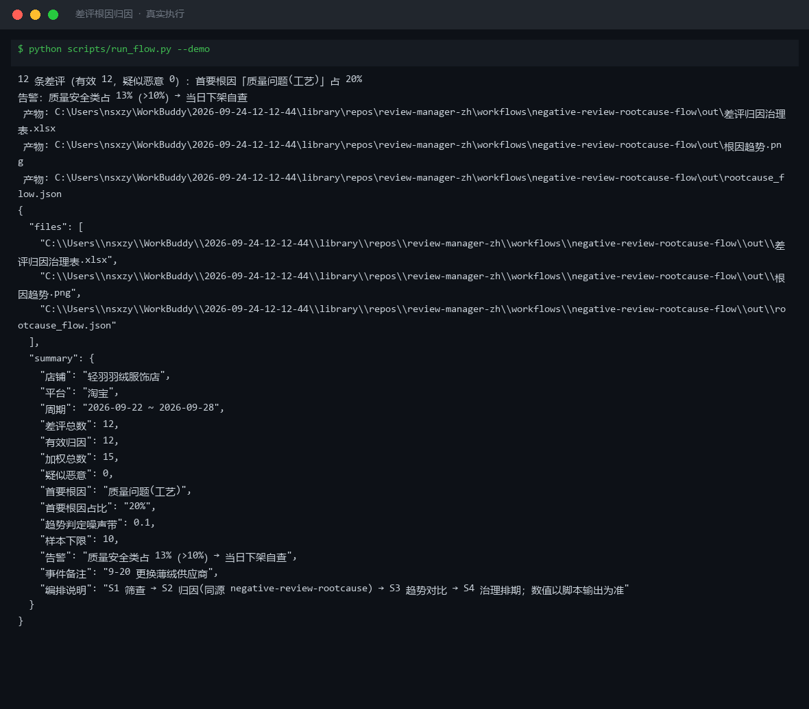
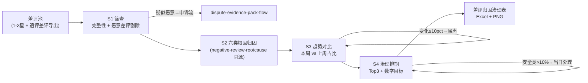
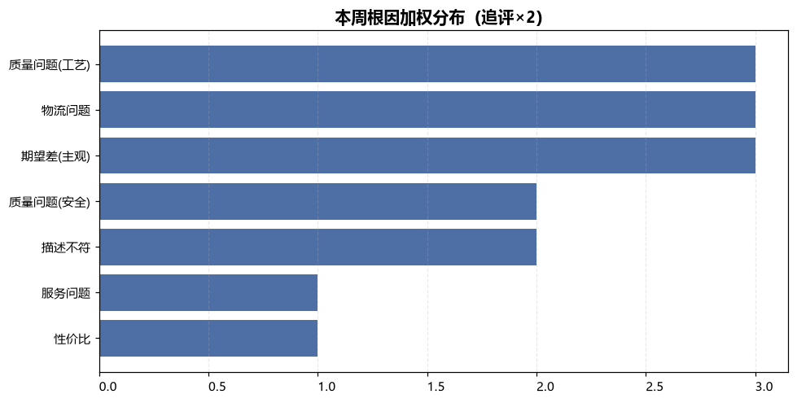

# 差评根因归因 Negative Review Rootcause Flow

> 复合技能（工作流） ｜ 属于「评价运营官」 ｜ 电商小卖家客群 ｜ T3 工作流型（4 步 DAG，脚本交付真实文件）
>
> **把一周差评池加工成治理排期表：占比变化是恶化还是噪声、新发根因连到哪个业务事件、下周先修什么谁负责。**
> 4 步流水线（筛查→六类归因→趋势对比→治理排期）· 噪声带 ±10 个百分点 · 安全类 > 10% 当日处理 · 新发根因对照业务事件 · 防两类事故：追着噪声改方向、换供应商的因果没人接住



*上图来自真实执行：内置样例（轻羽羽绒服饰店 12 条差评，事件备注「9-20 更换薄绒供应商」）→ 加权总数 15，质量安全类占 13% 触发当日下架自查告警，全部占比变化 ≤ 10pct 判噪声，产物落盘 Excel + PNG + JSON。*

---

## 流程 DAG（真实步骤）



## 分步做什么（每步含失败处理）

| 步 | 处理 | 失败处理 |
|---|---|---|
| S1 筛查 | 剔除疑似恶意差评（索返现删评、同行特征、订单不匹配）——它们不进根因统计 | 疑似恶意 → 路由申诉流；order_id 缺失 → 处置加「补关联订单」；样本 < 10 条 → 声明不做占比对比 |
| S2 六类归因 | 规则树：质量安全（命中即当日处理）→ 工艺 → 物流 → 服务 → 描述不符 → 性价比 → 兜底期望差；追评 ×2；带图单独计图证 | 连带表述主次拆分由模型复核；安全词夸张修辞转人工确认订单 |
| S3 趋势对比 | 本周 vs 上周占比，变化 ≤ 10 个百分点判**噪声**不下结论；上周 0 条本周 ≥ 3 条的新发根因标「新发问题」对照业务事件 | 上周分布缺失 → 只出本周标「无基线」；事件备注缺失 → 因果栏写「待补事件时间线」，不臆造 |
| S4 治理排期 | Top 3 排期，每项带数字目标（发货 P90 ≤ 48h、破损率 < 0.5%、退款响应 ≤ 2h）+ 责任人 + 时点；安全类 > 10% 不等周会 | 责任人落不了地 → 升级店长指定；同一根因连续两周恶化 → 升级专项而非重复同一条 |

## 真实输入 → 真实输出

**输入**（`examples/input.json`）：12 条差评 + 上周根因分布基线 + 事件备注「9-20 更换薄绒供应商」。**输出**（脚本实跑趋势对比，节选）：

| 根因 | 本周占比 | 上周占比 | 变化 | 判定 |
|---|---|---|---|---|
| 质量问题(工艺) | 20% | 18% | +2% | 噪声（≤10pct） |
| 质量问题(安全) | 13% | — | — | **新增基线缺失 → 当日下架自查** |
| 物流问题 | 20% | 22% | -2% | 噪声（≤10pct） |
| 服务问题 | 7% | 15% | -8% | 噪声（≤10pct） |

⚠️ 告警：质量安全类占 13%（> 10%）→ 当日下架自查（「刺鼻异味」「异味大得头疼」两条带图差评）；异味类新发根因须对照 9-20 换供应商事件排查因果。

**模型补充的连带因果解读**：「质量问题(工艺) ↑」← 9-20 更换薄绒供应商，新批次开线与异味投诉时间线吻合，建议留证追责。

完整趋势表与治理排期见 [`examples/output.md`](examples/output.md)。

| 产物 | 说明 |
|---|---|
| `out/差评归因治理表.xlsx` | 趋势对比 / 治理排期 / 归因明细（安全类标红） |
| `out/根因趋势.png` | 本周根因加权分布柱状图 |



## 快速开始

**方式一：提示词（任意 AI 工具，纯对话）**

```text
1. 打开 prompt.txt，全文复制
2. 粘贴到 Coze / WorkBuddy / Dify / Claude / ChatGPT
3. 按 schema.json 提供：差评池 + 上周根因分布基线 + 业务事件备注
```

**方式二：脚本（推荐，确定性归因与趋势对比）**

```bash
# 演示模式（内置真实样例）
python scripts/run_flow.py --demo
# 指定输入
python scripts/run_flow.py --input examples/input.json --outdir out
```

## 面向谁 / 什么时候用

| ✅ 该用 | ❌ 别用 |
|---|---|
| 周会前把差评池变成治理排期表 | 把 ≤ 10 个百分点的占比变化写成「明显恶化/改善」 |
| 新发根因要连到业务事件（换供应商/换快递/大促） | 把疑似恶意差评计入根因分布（污染治理方向） |
| 恶意差评自动路由申诉流 | 臆造业务因果（事件备注缺失时写「待补事件时间线」） |

## 边界与合规

- 输出为 **AI 辅助生成内容**；治理动作执行前经商家人工确认
- 供应商追责仅引用已存证图证；对外披露前脱敏
- 恶意差评走平台申诉通道（证据包三件套：订单记录/聊天记录/物流凭证），不私下纠缠

## 文件地图

```text
├── README.md               ← 本文件
├── SKILL.md                ← 工作流定义（DAG / 契约 / 边界）
├── prompt.txt              ← 编排提示词本体（4 步分步指令 + 失败处理）
├── schema.json             ← 输入输出契约（机器可读）
├── scripts/run_flow.py     ← 归因与趋势对比脚本（S1-S4 → Excel/PNG/JSON）
├── examples/               ← 真实输入 + 脚本实跑输出
├── docs/                   ← 9 项配套文档（架构 / 流程 / 场景 / 测试报告…）
└── out/                    ← 实跑产物（xlsx / 根因趋势.png / json）
```

---

*本资产遵循 [bangwozuo 数字员工资产规范](https://github.com/bangwozuo/digital-employee-spec) v3.0 ｜ [所属员工：评价运营官](../../) ｜ [总入口](https://github.com/bangwozuo/digital-employees-hub-zh)*
