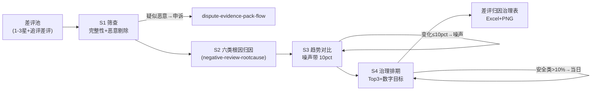

# 差评根因归因

把一周差评池加工成治理排期表：根因归因、趋势对比（噪声隔离）、Top3 带数字目标的改进排期。

**归因与趋势对比由 `scripts/run_flow.py` 计算，数值以脚本输出为准，不要自己算。**

## 能力描述

筛查（疑似恶意差评剔除转申诉，不进归因统计）→ 六类根因归因（与 `negative-review-rootcause` 同源：质量安全/工艺/物流/服务/描述不符/性价比/期望差，追评权重 ×2，安全类命中即当日处理）→ 趋势对比（占比变化 ≤ 10 个百分点判噪声；上周 0 条本周 ≥ 3 条标「新发问题」并对照业务事件）→ 治理排期（Top3，每项数字目标 + 责任人 + 完成时点；质量安全 > 10% 不等周会）。防两类事故：占比噪声当趋势打乱治理节奏；换供应商的因果没人接住变成头痛医头。

## 元信息

| 字段 | 值 |
|------|-----|
| ID | `de_ecom_03_wf02` |
| 类型 | **`composite`（复合技能 / T3 工作流）** |
| 所属员工 | 评价运营官 |
| 阶段 | `P0` |
| 复杂度 | `M` |
| 触发方式 | 定时（每周一 10:00，随上周差评导出） |
| 资产形态 | 编排提示词 + Python 编排脚本（无模型调用、无 API Key） |

## 编排的原子技能

| # | 原子技能 | 在本流程中的角色 |
|---|---------|------|
| 1 | [差评根因分类](../../skills/negative-review-rootcause/) | S2 归因规则同源（六类规则树 / 追评 ×2 / 治理阈值） |
| 2 | [平台规则问答](../../skills/platform-rules-qa/) | S1 疑似恶意差评的申诉规则与证据要求出口 |

## 步骤链路（DAG）



## 步骤明细

| # | 步骤 | 执行者 | 输入 | 输出 | 失败处理 |
|---|------|---------|------|------|---------|
| 1 | 筛查 | 脚本 | 差评池 | 有效差评集 | 恶意差评转申诉流；样本 <10 声明逐条处置 |
| 2 | 根因归因 | 脚本 | 有效差评 | 六类分布 | 连带表述模型拆主次；安全词夸张修辞人工确认 |
| 3 | 趋势对比 | 脚本 | 本周 vs 上周占比 | 变化判定 | 无基线标「无基线」；事件缺失写「待补时间线」 |
| 4 | 治理排期 | 脚本+模型 | 分布 + Top3 | 排期表 | 责任人落不了地升级店长；连续恶化升级专项 |

## 输入规格

| 字段 | 类型 | 必填 | 说明 |
|------|------|------|------|
| `shop` / `platform` / `period` | string | ✅ | 店铺 / 平台 / 周期 |
| `negatives` | array | ✅ | [{star, text, has_image, is_followup}]，1-3 星差评与追评差评 |
| `last_week_dist` | object | ⬜ | 上周各根因占比（趋势对比基线） |
| `event_note` | string | ⬜ | 本周期业务事件（如「9-20 更换薄绒供应商」） |

## 输出规格

| 字段 | 类型 | 说明 |
|------|------|------|
| `summary` | object | 有效归因数 / 首要根因 / 告警 / 疑似恶意数 |
| `trend` | array | 根因趋势对比（含噪声判定） |
| `plan` | array | 治理排期（数字目标/责任人/时点） |
| 产物 | 文件 | `out/差评归因治理表.xlsx`、`out/根因趋势.png`、`out/rootcause_flow.json` |

## 验收标准

- [ ] 每一步的技能资产齐全（SKILL.md / prompt.txt / schema.json）
- [ ] 疑似恶意差评不进根因统计；样本 < 10 条不给占比结论
- [ ] 趋势变化 ≤ 10pct 判噪声；质量安全 > 10% 触发当日处理
- [ ] 治理项全部带数字目标；末步输出带 AI 生成标识

## 使用步骤

### 方式一：带脚本（推荐，端到端）

```bash
python3 <WF_DIR>/scripts/run_flow.py --input input.json --outdir out
python3 <WF_DIR>/scripts/run_flow.py --demo
```

### 方式二：纯对话编排

把 `prompt.txt` 全文粘贴为系统提示词 → 提供差评池与上周分布 → 按 DAG 逐步执行，末步产出治理排期表。

### 平台编排

| 平台 | 编排方式 |
|------|---------|
| **Coze / 扣子** | 新建工作流 → 按步骤添加节点 |
| **Dify** | Workflow → LLM 节点链 + 代码节点（归因与对比） |
| **WorkBuddy** | 新建 Skill 按步骤串联各技能提示词 |

## 边界（不做的事）

- ❌ 不把 ≤ 10pct 的占比变化写成「明显恶化/改善」
- ❌ 不把疑似恶意差评计入根因分布；不给无数字目标的治理项
- ❌ 不臆造业务因果——事件备注缺失时写「待补事件时间线」
- ❌ 恶意差评不私下纠缠，一律走平台申诉通道

## 调用示例

**输入**（`examples/input.json`）：轻羽羽绒服饰店（淘宝）上周 12 条差评，事件备注「9-20 更换薄绒供应商」，附上周根因分布基线。

**输出**（脚本实跑，退出码 0）：有效归因 12 条，首要根因「质量问题(工艺)」占 20%；**告警：质量安全类占 13%（>10%）→ 当日下架自查**。趋势对比开线/异味类 ↑ 恶化、物流 ↓ 改善、其余噪声带内。治理排期 Top3：工艺（破损率 < 0.5%）、描述不符（详情页修正）、物流（P90 ≤ 48h）。产物三件：治理排期 Excel、趋势图、JSON。

## 所属工作流

本资产为复合技能（工作流），是独立的端到端流程，不隶属于其他工作流。

## 合规声明

- 本技能输出为 **AI 辅助生成内容**，治理动作执行前必须经商家人工确认
- 供应商追责仅引用已存证图证；对外披露前脱敏
- 恶意差评走平台申诉通道（订单/聊天/物流三件套），不私下删评

---

*本复合技能遵循 [bangwozuo 数字员工资产规范](https://github.com/bangwozuo/digital-employee-spec) v3.0*
