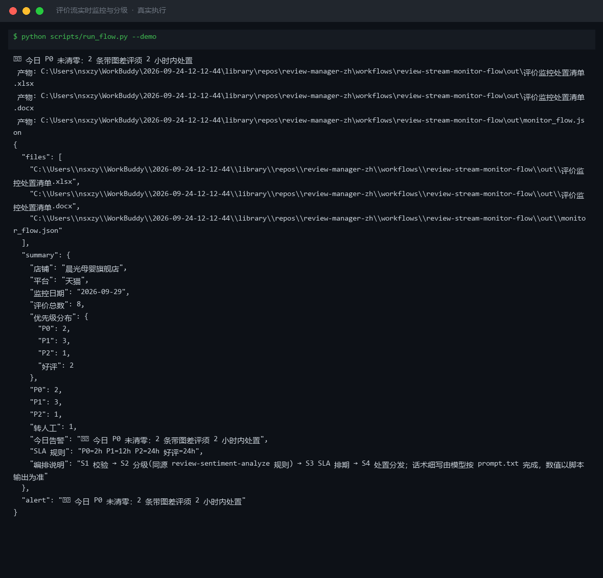
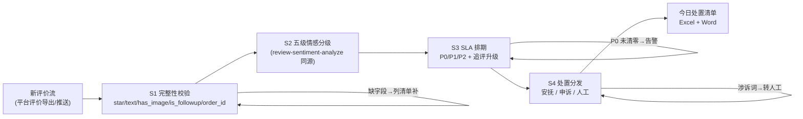

# 评价流实时监控与分级 Review Stream Monitor Flow

> 复合技能（工作流） ｜ 属于「评价运营官」 ｜ 电商小卖家客群 ｜ T3 工作流型（4 步 DAG，脚本交付真实文件）
>
> **把一天内新进的评价流变成一张「今日必办」清单：什么级别、几小时内必须响应、走安抚还是申诉还是转人工。**
> 4 步流水线（完整性校验→五级分级→SLA 排期→处置分发）· P0 带图差评 2h / P1 12h / P2 24h 三档 SLA · 追评差评自动升级 · 涉诉风险词命中即转人工 · 防两类事故：带图差评挂过夜、涉诉评价走模板



🎬 **[▶ 观看演示视频](docs/assets/demo.mp4)** — 四幕检测叙事：业务钩子 → 真实执行 → 检查项逐条亮灯 → 交付物

*上图来自真实执行：内置样例（晨光母婴旗舰店当日 8 条评价）→ P0×2 / P1×3 / P2×1 / 好评×2，触发「P0 未清零」告警，1 件命中涉诉风险词转人工，产物落盘 Excel + Word + JSON。*

---

## 流程 DAG（真实步骤）



## 三档 SLA 与分发路由（脚本执行）

| 优先级 | SLA | 范围 | 分发去向 |
|---|---|---|---|
| **P0 带图差评** | **2 小时** | 星 ≤ 3 且带图（首屏图证差评每小时流失转化） | 安抚回复 + 质量类同步根因归因；日终未清零触发告警到店长 |
| P1 强负无图 | 12 小时 | 强负无图；**追评差评自动升一级** | 安抚回复（appease-script-generate 写 30-80 字） |
| P2 负面（3 星） | 24 小时 | 中间态不满 | 标准回复 + 期望管理口径 |
| 好评 | 24 小时 | 4-5 星 | 30-80 字回复（不诱导晒图返利） |

**涉诉风险词**（12315 / 工商 / 曝光 / 媒体 / 假货 / 过敏 / 腹泻 / 受伤）命中即转人工名单——停用一切模板，店长 2 小时内介入。

**降级策略**：单日评价 > 500 条导致 SLA 不可达 → 按「P0 全保、P1 保涉诉、P2 排队」降级并显式声明。

## 真实输入 → 真实输出

**输入**（`examples/input.json`）：当日 8 条评价（每条含 `order_id`）：

```json
{
  "shop": "晨光母婴旗舰店", "platform": "天猫", "monitor_date": "2026-09-29",
  "reviews": [
    {"star": 1, "text": "奶瓶到手就裂了，还划到手，这种质量问题必须曝光", "has_image": true, "is_followup": false, "order_id": "TB20260929001"}
  ]
}
```

**输出**（脚本实跑，节选）：

| 序号 | 优先级 | SLA | 摘要 | 处置动作 |
|---|---|---|---|---|
| 1 | P0 | 2 小时内 | 奶瓶到手就裂了，还划到手…必须曝光 | **转人工+店长介入（涉诉风险词）**，留证原话与截图 |
| 3 | P0 | 2 小时内 | 宝宝用了红屁股…（追评升级） | 转人工+店长介入（涉诉风险词） |
| 2 | P1 | 12 小时内 | 奶粉勺子没放，找客服三天没人理 | 安抚回复 + 根因归因 |
| 4 | P2 | 24 小时内 | 奶嘴流速太快，宝宝呛了好几次 | 标准回复 + 期望管理口径 |

好评回复队列 2 条（24 小时内 30-80 字，不诱导晒图返利）。完整清单见 [`examples/output.md`](examples/output.md)。

| 产物 | 说明 |
|---|---|
| `out/评价监控处置清单.xlsx` | 今日必办（P0 标红）/ 好评回复 / 汇总 |
| `out/评价监控处置清单.docx` | 交接用 Word（含转人工名单与 SLA） |
| `out/monitor_flow.json` | 机器可读结果 |

## 快速开始

**方式一：提示词（任意 AI 工具，纯对话）**

```text
1. 打开 prompt.txt，全文复制
2. 粘贴到 Coze / WorkBuddy / Dify / Claude / ChatGPT
3. 按 schema.json 提供当日新评价数组（必须来自平台导出/推送，含订单号）
```

**方式二：脚本（推荐，确定性 SLA 排期）**

```bash
# 演示模式（内置真实样例）
python scripts/run_flow.py --demo
# 指定输入
python scripts/run_flow.py --input examples/input.json --outdir out
```

## 面向谁 / 什么时候用

| ✅ 该用 | ❌ 别用 |
|---|---|
| 每天早上 5 分钟排定「今日必办」，不让带图差评过夜 | 无原文记录的口头反馈进监控流（「有个买家骂我们」不算） |
| 涉诉评价自动识别转人工，不走模板激化 | 对涉诉评价用模板回复（12315/曝光类一律人工） |
| 单日评价爆量时按降级策略保 P0 | 在好评回复里诱导晒图返利（返现换图属诱导好评，违规） |

## 边界与合规

- 输出为 **AI 辅助生成内容**；对外回复发布前人工确认
- 处置与补偿遵守各平台评价规则；诱导改评、私下删评一律不做
- 转人工案件的证据留存符合申诉要求（订单/聊天/物流三件套）

## 文件地图

```text
├── README.md               ← 本文件
├── SKILL.md                ← 工作流定义（DAG / 契约 / 边界）
├── prompt.txt              ← 编排提示词本体（4 步分步指令 + SLA 表）
├── schema.json             ← 输入输出契约（机器可读）
├── scripts/run_flow.py     ← 分级与 SLA 排期脚本（S1-S4 → Excel/Word/JSON）
├── examples/               ← 真实输入 + 脚本实跑输出
├── docs/                   ← 9 项配套文档（架构 / 流程 / 场景 / 测试报告…）
└── out/                    ← 实跑产物（xlsx / docx / json）
```

---

*本资产遵循 [bangwozuo 数字员工资产规范](https://github.com/bangwozuo/digital-employee-spec) v3.0 ｜ [所属员工：评价运营官](../../) ｜ [总入口](https://github.com/bangwozuo/digital-employees-hub-zh)*
