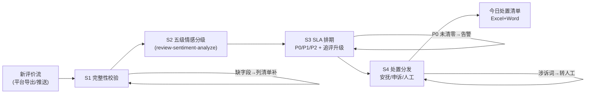

# 评价流实时监控与分级

把一天的新评价流变成「今日必办」清单：每条什么级别、几小时内响应、走安抚还是申诉还是转人工。

**分级与 SLA 排期由 `scripts/run_flow.py` 计算，数值以脚本输出为准，不要自己算。**

## 能力描述

数据校验（评价须来自平台导出）→ 五级情感分级（与 `review-sentiment-analyze` 同源规则：带图差评 P0 / 强负 P1 / 负面 P2 / 追评自动升级）→ SLA 排期（P0 2 小时、P1 12 小时、P2 24 小时、好评 24 小时内 30-80 字回复；P0 日终未清零告警）→ 处置分发（安抚话术 / 恶意差评申诉 / 涉诉词转人工停用模板）。防两类事故：带图差评挂着过夜流失转化；涉诉评价被模板话术激化升级。

## 元信息

| 字段 | 值 |
|------|-----|
| ID | `de_ecom_03_wf01` |
| 类型 | **`composite`（复合技能 / T3 工作流）** |
| 所属员工 | 评价运营官 |
| 阶段 | `P0` |
| 复杂度 | `M` |
| 触发方式 | 定时（每 2 小时拉取当日新评价） |
| 资产形态 | 编排提示词 + Python 编排脚本（无模型调用、无 API Key） |

## 编排的原子技能

| # | 原子技能 | 在本流程中的角色 |
|---|---------|------|
| 1 | [评价情感分析](../../skills/review-sentiment-analyze/) | S2 分级规则同源（五级情感 / P0-P2 优先级 / 追评升级） |
| 2 | [安抚话术生成](../../skills/appease-script-generate/) | S4 中 P0/P1 案件回复话术（30-80 字，不超授权） |
| 3 | [差评根因分类](../../skills/negative-review-rootcause/) | S4 中质量类 P0 的批次排查前置 |
| 4 | [平台规则问答](../../skills/platform-rules-qa/) | S4 中疑似恶意差评的申诉规则出口 |

## 步骤链路（DAG）



## 步骤明细

| # | 步骤 | 执行者 | 输入 | 输出 | 失败处理 |
|---|------|---------|------|------|---------|
| 1 | 完整性校验 | 脚本 | 当日新评价 | 合格数据集 | 缺 star/text 进待补清单；跨度过 24h 标「回补」 |
| 2 | 情感分级 | 脚本 | 评价列表 | 强负/负面/中/正/强正 | 反讽由模型复核改判；刷评线索圈出不进流 |
| 3 | SLA 排期 | 脚本 | 分级结果 | P0/P1/P2 + 时限 | P0 日终未清零告警；超 500 条/日启用降级策略 |
| 4 | 处置分发 | 脚本+模型 | 排期清单 | 处置动作 + 话术 | 模板穿帮退回重写；二次投诉升级店长 |

## 输入规格

| 字段 | 类型 | 必填 | 说明 |
|------|------|------|------|
| `shop` | string | ✅ | 店铺名 |
| `platform` | string | ✅ | 平台 |
| `monitor_date` | string | ✅ | 监控日期 |
| `reviews` | array | ✅ | [{star, text, has_image, is_followup, order_id?}]，来自平台导出 |

## 输出规格

| 字段 | 类型 | 说明 |
|------|------|------|
| `summary` | object | 优先级分布 / 转人工数 / 今日告警 / SLA 规则 |
| `todo` | array | 今日必办（按 P0→P2 排序，含 SLA 与处置动作） |
| `good_replies` | array | 好评回复队列 |
| 产物 | 文件 | `out/评价监控处置清单.xlsx`、`out/评价监控处置清单.docx`、`out/monitor_flow.json` |

## 验收标准

- [ ] 每一步的技能资产齐全（SKILL.md / prompt.txt / schema.json）
- [ ] 分级规则与 review-sentiment-analyze 同源，无口径漂移
- [ ] P0 带图差评 2 小时 SLA；涉诉词命中全部进转人工名单
- [ ] 末步输出带 AI 生成标识，对外回复经人工确认

## 使用步骤

### 方式一：带脚本（推荐，端到端）

```bash
python3 <WF_DIR>/scripts/run_flow.py --input input.json --outdir out
python3 <WF_DIR>/scripts/run_flow.py --demo
```

### 方式二：纯对话编排

把 `prompt.txt` 全文粘贴为系统提示词 → 提供当日评价 → 按 DAG 逐步执行，末步产出「今日必办」清单。

### 平台编排

| 平台 | 编排方式 |
|------|---------|
| **Coze / 扣子** | 新建工作流 → 按步骤添加节点 |
| **Dify** | Workflow → LLM 节点链 + 代码节点（分级与排期） |
| **WorkBuddy** | 新建 Skill 按步骤串联各技能提示词 |

## 边界（不做的事）

- ❌ 不让带图差评过夜——P0 两小时 SLA，日终未清零必须告警到人
- ❌ 不对涉诉评价用模板回复——12315/曝光类一律转人工
- ❌ 不在好评回复里诱导晒图返利（返现换图属诱导好评，违规）
- ❌ 不编造评价；无原文记录的口头反馈不进监控流

## 调用示例

**输入**（`examples/input.json`）：晨光母婴旗舰店（天猫）2026-09-29 当日 8 条评价，含 2 条带图差评（1 条「划到手+曝光」涉诉）、1 条追评差评。

**输出**（脚本实跑，退出码 0）：P0×2（均转人工：安全类涉诉词命中）、P1×2、P2×2、好评×2。告警「今日 P0 未清零：2 条带图差评须 2 小时内处置」。转人工名单 2 件（店长 2 小时介入）。产物三件：处置清单 Excel（P0 标红）、交接 Word、JSON。

## 所属工作流

本资产为复合技能（工作流），是独立的端到端流程，不隶属于其他工作流。

## 合规声明

- 本技能输出为 **AI 辅助生成内容**，对外回复发布前必须经人工确认
- 处置与补偿遵守各平台评价规则，诱导改评、私下删评一律不做
- 转人工案件证据留存符合申诉要求（订单/聊天/物流三件套）

---

*本复合技能遵循 [bangwozuo 数字员工资产规范](https://github.com/bangwozuo/digital-employee-spec) v3.0*
