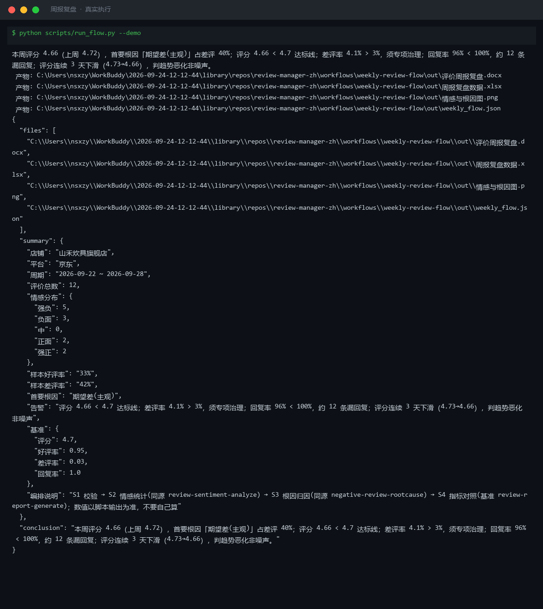
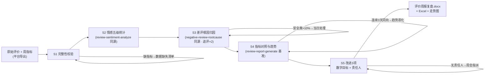
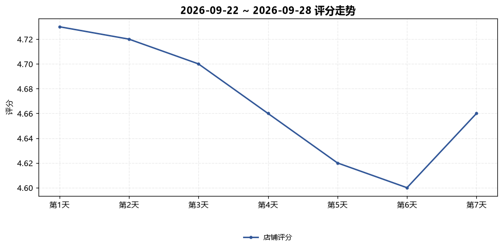

# 周报复盘 Weekly Review Flow

> 复合技能（工作流） ｜ 属于「评价运营官」 ｜ 电商小卖家客群 ｜ T3 工作流型（5 步 DAG，脚本交付真实文件）
>
> **把一周原始评价 + 周指标加工成周会能直接过、下周能直接干的复盘 Word：走势、根因分布、指标对照、改进 3 项。**
> 5 步流水线（校验→情感统计→根因归因→指标对照→改进排期）· 6 项指标基准 · 大促回吐 48h 不判趋势 · 变化 ≤ 2pct 判噪声 · 防两类事故：周报变表格搬运、大促回吐误判恶化



🎬 **[▶ 观看演示视频（在线播放）](https://cdn.jsdelivr.net/gh/bangwozuo/review-manager-zh@main/workflows/weekly-review-flow/docs/assets/demo.mp4) · [GitHub 页](https://github.com/bangwozuo/review-manager-zh/blob/main/workflows/weekly-review-flow/docs/assets/demo.mp4)** — 四幕数据叙事：业务钩子 → 真实执行 → 指标条形图生长 → 交付物

*上图来自真实执行：内置样例（山禾炊具旗舰店，12 条评价 + 周指标评分 4.66 / 差评率 4.1% / 回复率 96%）→ 判「评分连续 3 天下滑属趋势恶化非噪声，差评率 4.1% 须专项治理」，产物落盘 Word + Excel + PNG + JSON。*

---

## 流程 DAG（真实步骤）



## 分步做什么（每步含失败处理）

| 步 | 处理 | 失败处理 |
|---|---|---|
| S1 完整性校验 | 评价须来自平台导出；指标缺失段位标「数据缺失」列缺口清单 | 上周指标缺失 → 只报本周标「无基线」；评价 < 10 条 → 占比只作参考 |
| S2 情感统计 | 强负/负面/中/正面/强正；样本好评率与平台口径并列（默认好评单列） | 反讽/刷评线索模型复核改判；默认好评占比 > 30% 标「口径偏乐观」 |
| S3 根因归因 | 六类规则树；追评 ×2；安全类 > 10% 当日处理不等周会 | 连带表述主次拆分模型复核；疑似恶意剔除转申诉流 |
| S4 指标对照 | 六项基准：评分 ≥ 4.7 / 好评率 ≥ 95% / 差评率 ≤ 3% / 回复率 100% / 差评响应 ≤ 2h / 一般响应 ≤ 24h；变化 ≤ 2pct 判噪声 | 回复率漏条数 > 0 → 列出漏回复订单清单追问原因 |
| S5 改进 3 项 | 根因 Top 3 → 数字目标（发货 P90 ≤ 48h、破损率 < 0.5%、退款响应 ≤ 2h）+ 责任人 + 时点 | 责任人落不了地 → 周会指派记录；同一根因连续两周恶化 → 升级专项 |

## 真实输入 → 真实输出

**输入**（`examples/input.json`）：12 条原始评价 + 本周/上周指标 + 7 天走势。**输出**（脚本实跑核心结论原文）：

> 本周评分 4.66（上周 4.72），首要根因「期望差(主观)」占差评 40%；评分 4.66 < 4.7 达标线；差评率 4.1% > 3%，须专项治理；回复率 96% < 100%，约 12 条漏回复；评分连续 3 天下滑（4.73→4.66），判趋势恶化非噪声。

**指标对照（节选）**：

| 指标 | 本周 | 上周 | 基准 | 判定 |
|---|---|---|---|---|
| 店铺评分 | 4.66 | 4.72 | 4.7 | 未达标 |
| 差评率 | 4.1% | 3.3% | ≤3% | 未达标（专项） |
| 一般评价响应 | 19.0h | 17.0h | ≤24 | 达标 |

**模型补充业务解释**：「锅比较重/偏厚」类期望差占 40%，须在详情页补重量与锅底厚度参数；涂层起皮/把手松动连到工艺批次排查。

完整报告见 [`examples/output.md`](examples/output.md)。

| 产物 | 说明 |
|---|---|
| `out/评价周报复盘.docx` | 六段式 Word 周报（走势图内嵌 + 人工确认事项） |
| `out/周报复盘数据.xlsx` | 指标对照（未达标标红）/ 根因分布 / 改进项 |
| `out/情感与根因图.png` | 7 天评分走势折线图 |



## 快速开始

**方式一：提示词（任意 AI 工具，纯对话）**

```text
1. 打开 prompt.txt，全文复制
2. 粘贴到 Coze / WorkBuddy / Dify / Claude / ChatGPT
3. 按 schema.json 提供：原始评价 + 本周/上周指标 + 7 天走势
```

**方式二：脚本（推荐，端到端出 Word）**

```bash
# 演示模式（内置真实样例）
python scripts/run_flow.py --demo
# 指定输入
python scripts/run_flow.py --input examples/input.json --outdir out
```

## 面向谁 / 什么时候用

| ✅ 该用 | ❌ 别用 |
|---|---|
| 每周一出周报复盘，周会直接过、下周直接干 | 大促后 48 小时差评冲高判趋势恶化（标「大促回吐」） |
| 改进项必须带数字目标、责任人、完成时点 | 变化 ≤ 2 个百分点就下结论；把条数当比率对比 |
| 数据缺口显式化（缺哪项列哪项） | 用估算值填充缺失数据；写「整体向好」式空总结 |

## 边界与合规

- 报告标注 **AI 生成内容**；对外（平台小二/供应商）引用前人工复核
- 供应商追责仅引用已存证图证；刷评疑点先内部核实不外披露
- 引用评价内容须脱敏，不带买家个人信息；周会确认的改进项进入下周 review-stream-monitor-flow 监控重点

## 文件地图

```text
├── README.md               ← 本文件
├── SKILL.md                ← 工作流定义（DAG / 契约 / 边界）
├── prompt.txt              ← 编排提示词本体（5 步分步指令 + 基准表）
├── schema.json             ← 输入输出契约（机器可读）
├── scripts/run_flow.py     ← 端到端脚本（S1-S5 → Word/Excel/PNG/JSON）
├── examples/               ← 真实输入 + 脚本实跑输出
├── docs/                   ← 9 项配套文档（架构 / 流程 / 场景 / 测试报告…）
└── out/                    ← 实跑产物（docx / xlsx / 情感与根因图.png / json）
```

---

*本资产遵循 [bangwozuo 数字员工资产规范](https://github.com/bangwozuo/digital-employee-spec) v3.0 ｜ [所属员工：评价运营官](../../) ｜ [总入口](https://github.com/bangwozuo/digital-employees-hub-zh)*
