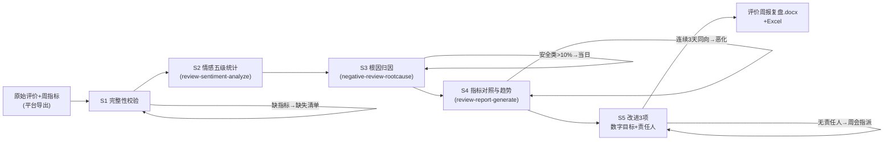

# 周报复盘

把一周原始评价 + 周指标加工成周会能直接过的复盘 Word：走势、根因、对比、改进 3 项。

**情感统计、根因归因、指标对照与 Word 产物由 `scripts/run_flow.py` 端到端完成，数值以脚本输出为准，不要自己算。**

## 能力描述

数据校验（缺指标标「数据缺失」列缺口清单）→ 情感五级统计（与 `review-sentiment-analyze` 同源，默认好评单独标注口径）→ 差评根因归因（与 `negative-review-rootcause` 同源，追评 ×2，质量安全 > 10% 当日处理）→ 指标对照与趋势（评分 ≥ 4.7 / 好评率 ≥ 95% / 差评率 ≤ 3% 专项 / 回复率 100%（30-80 字/条）/ 差评响应 ≤ 2 小时；变化 ≤ 2 个百分点判噪声；连续 3 天同向下滑判趋势恶化）→ 下周改进 3 项（根因 Top 3，每项数字目标 + 责任人 + 时点）。防两类事故：周报变成表格搬运；大促回吐误判恶化。

## 元信息

| 字段 | 值 |
|------|-----|
| ID | `de_ecom_03_wf05` |
| 类型 | **`composite`（复合技能 / T3 工作流）** |
| 所属员工 | 评价运营官 |
| 阶段 | `P0` |
| 复杂度 | `M` |
| 触发方式 | 定时（每周一 10:00，随上周评价全量导出） |
| 资产形态 | 编排提示词 + Python 编排脚本（无模型调用、无 API Key） |

## 编排的原子技能

| # | 原子技能 | 在本流程中的角色 |
|---|---------|------|
| 1 | [评价情感分析](../../skills/review-sentiment-analyze/) | S2 情感五级统计规则同源 |
| 2 | [差评根因分类](../../skills/negative-review-rootcause/) | S3 六类根因归因规则同源 |
| 3 | [复盘报告生成](../../skills/review-report-generate/) | S4 指标基准与周报六段结构同源 |

## 步骤链路（DAG）



## 步骤明细

| # | 步骤 | 执行者 | 输入 | 输出 | 失败处理 |
|---|------|---------|------|------|---------|
| 1 | 完整性校验 | 脚本 | 评价 + 指标 | 合格数据集 | 缺指标列缺口清单；无基线只报本周 |
| 2 | 情感统计 | 脚本 | 原始评价 | 五级分布 | 反讽/刷评由模型复核；默认好评>30% 标注口径 |
| 3 | 根因归因 | 脚本 | 1-3 星差评 | 六类分布 | 恶意差评剔除转申诉；安全类>10% 当日处理 |
| 4 | 指标对照 | 脚本 | 本周/上周指标 | 达标判定+趋势 | 噪声 ≤2pct 不下结论；漏回复列订单清单 |
| 5 | 改进排期 | 脚本+模型 | 根因 Top3 | 改进 3 项 | 责任人周会指派；连续恶化升级专项 |

## 输入规格

| 字段 | 类型 | 必填 | 说明 |
|------|------|------|------|
| `shop` / `platform` / `period` | string | ✅ | 店铺 / 平台 / 周期 |
| `metrics` | object | ✅ | {avg_score, good_rate, bad_rate, total_reviews, reply_rate, reply_hours_bad, reply_hours_norm} |
| `last_metrics` | object | ⬜ | 上周同结构（对比基线） |
| `score_trend` | array | ⬜ | 近 7 天评分序列 |
| `reviews` | array | ✅ | [{star, text, has_image, is_followup}] 原始评价 |

## 输出规格

| 字段 | 类型 | 说明 |
|------|------|------|
| `summary` | object | 情感分布 / 首要根因 / 告警 / 基准表 |
| `metrics` | array | 指标对照（达标/未达标/噪声标注） |
| `improves` | array | 下周改进 3 项 |
| 产物 | 文件 | `out/评价周报复盘.docx`、`out/周报复盘数据.xlsx`、`out/情感与根因图.png`、`out/weekly_flow.json` |

## 验收标准

- [ ] 每一步的技能资产齐全（SKILL.md / prompt.txt / schema.json）
- [ ] 分级与归因规则与对应原子技能同源，无口径漂移
- [ ] 数据缺失标「数据缺失」；变化 ≤ 2pct 判噪声；改进项全带数字目标
- [ ] 末步输出带 AI 生成标识，对外引用前人工复核

## 使用步骤

### 方式一：带脚本（推荐，端到端）

```bash
python3 <WF_DIR>/scripts/run_flow.py --input input.json --outdir out
python3 <WF_DIR>/scripts/run_flow.py --demo
```

### 方式二：纯对话编排

把 `prompt.txt` 全文粘贴为系统提示词 → 提供评价与指标 → 按 DAG 逐步执行，末步产出周报。

### 平台编排

| 平台 | 编排方式 |
|------|---------|
| **Coze / 扣子** | 新建工作流 → 按步骤添加节点 |
| **Dify** | Workflow → LLM 节点链 + 代码节点（统计与归因） |
| **WorkBuddy** | 新建 Skill 按步骤串联各技能提示词 |

## 边界（不做的事）

- ❌ 大促后 48 小时差评冲高不判趋势恶化；变化 ≤ 2pct 不下结论
- ❌ 不写无数字目标的改进项；数据缺失不用估算值填充
- ❌ 引用评价内容须脱敏；供应商追责仅引用已存证图证
- ❌ 恶意差评不进根因统计，转 dispute-evidence-pack-flow 申诉

## 调用示例

**输入**（`examples/input.json`）：山禾炊具旗舰店（京东），本周 12 条评价 + 指标（评分 4.66、差评率 4.1%、回复率 96%），上周基线与 7 天走势。

**输出**（脚本实跑，退出码 0）：核心结论「评分 4.66 < 4.7 达标线；差评率 4.1% > 3% 须专项治理；回复率 96% 漏约 12 条；评分连续 3 天下滑判趋势恶化」。根因分布 Top3 + 改进 3 项（工艺涂层、描述不符、物流）。产物四件：周报 Word（六段+走势图内嵌）、复盘 Excel、趋势图、JSON。

## 所属工作流

本资产为复合技能（工作流），是独立的端到端流程，不隶属于其他工作流。

## 合规声明

- 本技能输出为 **AI 辅助生成内容**，对外（平台/供应商）引用前必须人工复核
- 供应商追责仅引用已存证图证；刷评疑点先内部核实
- 周会确认的改进项进入下周 review-stream-monitor-flow 监控重点

---

*本复合技能遵循 [bangwozuo 数字员工资产规范](https://github.com/bangwozuo/digital-employee-spec) v3.0*
